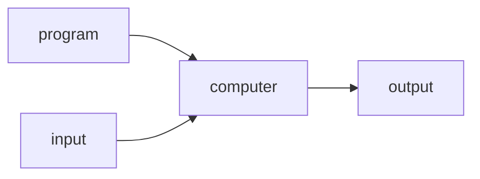
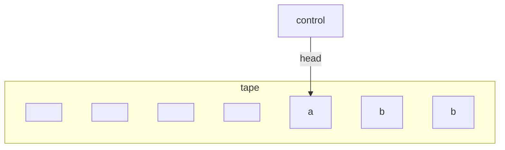
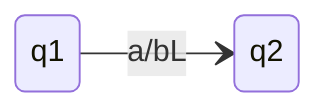

## What is a Computer
A **computer** is a machine that manipulates data according to a list of instructions:



It is impossible for computer to predict what any computer **program** will do.
{:.info}

## Turing Machines



A Turing machine can:

* **Read** and b to a tape that is infinitely long in **both** directions, at the **head position**.
* Can **move** the head **left** and **right**.
* Has two special states: **accept** and **reject**.

### Formal Definition
A Turing machine is $(Q,\Sigma,\Gamma,\delta,q_0,q_\text{acc},q_\text{rej})$:

* $Q$ is a finite set of **states**.
* $\Sigma$ is the **input alphabet** not containing the **blank symbol** $\square$.
* $\Gamma$ is the **tape alphabet** $(\Sigma\subseteq \Gamma)$ including $\square$.
* *q_0$ in $Q$ is the **start state**.
* $q_\text{acc},q_\text{rej}$ in $Q$ are the **accepting** and **rejecting state**.
* $\delta$ is the transition function:

	$$
	\delta:(Q-\{q_\text{acc},q_\text{rej}\})\times\Gamma\rightarrow Q\times\Gamma\times\{L,R\}
	$$

This definition states that Turing machines are deterministic. Deterministic Turing machines can simulate non-deterministic ones.
{:.info}

### Turing Machine Notation
The following state diagram:



means that if we read an $a$:

1. Replace with a $b$
1. Move **left**.

The **configuration** of the Turing machine can be written like so::

$$
abq_1a
$$

Where:

* $a,b$ - Denote the order of the data on the tape.
* $q_1$ - Represents the current head position and current state.

	```mermaid
	graph 
	q1 -->|head| a
	subgraph tape

	a1[a]
	b
	a
	3[ ]
	4[ ]
	end
	```

### Configurations
We say the configuration $C$ **yields** $C'$ if the TM can go from $C$ to $C'$ in **one** step:

$$
abq_1a \text{ yeilds } abbq_\text{acc}
$$

* The **start configuration** of the TM on input $w$ is $q_0w$.
* An **accepting configuration** is one that contains $q_\text{acc}$.
* A **rejecting configuration** is one that contains $q_\text{rej}$

### The Language of a Turing Machine
We say that $M$ accepts $x$ if there exists a sequence of configurations $C_0,C_1,\ldots,C_k$ where:

* $C_0$ is starting.
* $C_i$ yields $C_{i+1}$.
* $C_k$ is accepting.

### Halting
Turing Machines can get get into a loop where they never halt.

We say $M$ halts on $x$ if there exists a sequence of configurations $C_0,C_1,\ldots,C_k$ where:

* $C_0$ is starting.
* $C_i$ yields $C_{i+1}$.
* $C_k$ is accepting or rejecting.

A TM is **total** if it halts on every input.
{:.info}

A language $L$ is **recursive (decidable)** if it is recognised by a total TM.
{:.info}