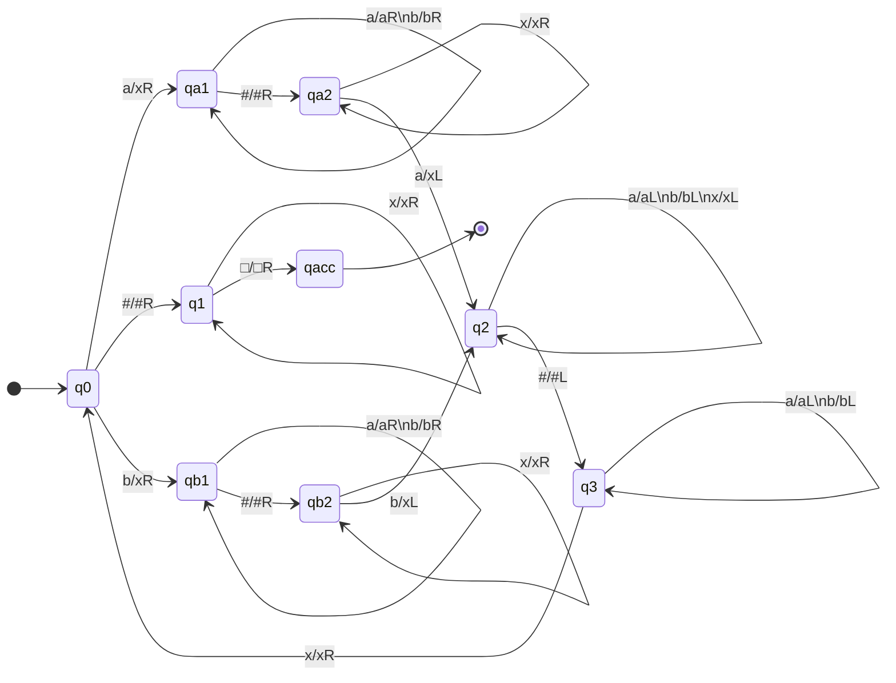

Consider that we want to make a TM that accepts the following language:

$$
L=\{w\#w:w\in\{a,b\}^*\}
$$

We can write the following program, that instructs the head:

1. **Until** you reach $\\#$  
	1. **Read** and remember entry ($x\underline bbaa\\#xbbaa$)  
		1. **Write** $x$ ($x\underline xbaa\\#xbbaa$)  
		1. **Move** right past $\\#$ and past all $x$s ($xxbaa\\#x\underline bbaa$)
	1. **If** this entry is different, **reject**  
		**otherwise**:
		1. **Write** $x$ ($xxbaa\\#x\underline baa$)
		1. **Move** left past $\\#$ and to right of first $x$ ($xx\underline baa\\#xxbaa$)
1. **If** you see only $x$s followed by $\square$, accept.

From this we can make the following state machine:

All other transitions go to $q_\text{rej}$.
{:.info}

We will generally just use the high level description for simplicity.
{:.info}

## Examples
There are additional examples of Turing machines that complete:

* Multiplication
* Comparing Strings
* Reading Graphs as Strings $\langle G\rangle$ (Serialisation)

in [the lecture video](https://liverpool.instructure.com/courses/47455/modules/items/1252553).