All variants of Turing machines have the same computational ability.

## The Church-Turing Thesis

> Every effectively calculable function is a computable function where:

* **Effectively Calculable** - Produced by any intuitively effective means whatsoever.
* **Effectively Computable** - Produced by a Turing-machine or equivalent mechanical device.

## Multitape Turing Machine
A multitape Turing machine has a head that can access to multiple different infinitely long tapes.

* The **transition** may depend on the contents of all the cells.
* Different tape heads can be moved **independently**. 

This can be more convenient but is not more computationally powerful.
{:.info}

We can use instructions like the following to instruct **three** heads:

```mermaid
stateDiagram
direction LR
q3 --> q7:0/1R\n□/1R\n0/0L
```



This would then take the Turing machine from the following state to the next:


Each line is an instruction for each of the three heads.
{:.info}

## Simulating a Multitape TM
We can represent a multitape machine by writing the contents next to each other on a single tape with infinite space $\\#$ between them.

So the following multitapes:

* $x_1,x_2,\ldots,\overset \downarrow {x_a}\ldots,x_i,\ldots$
* $y_1,y_2,\ldots,\overset \downarrow {y_a},\ldots$
* $z_1,z_2,\ldots,\overset \downarrow {z_a},\ldots$

can be represented as the following single tape:

* $\overset \downarrow \\#,x_1,x_2,\ldots,\dot{x_a},\ldots,x_i\\#y_1,y_2,\ldots\dot{y_a}\\#z_1,z_2,\ldots\dot{z_a}\\#$

Therefore we can use the following method on input $w_1,w_n$:

1. Replace the tape contents by $\\#\dot{w_1},w_2\ldots w_n\\#\dot{\square}\\#\dot{\square}\\#$ and remember (in state) that $M$ is in state $q_0$.
1. To simulate a step of $M$, make a pass over the tape to find $\dot{x},\dot{y},\dot{z}$. If $M$ is in state $q_j$ and has transition:
	
	```mermaid
	stateDiagram
	direction LR
	qj --> qi:x/x'A\ny/y'B\nz/z'C
	```
	
	update the state/tap accordingly.
1. If $M$ reaches accept/reject state, accept/reject.

## Non-Deterministic Turing Machines
This type of Turing machine has no addition expressive power compared to a regular Turing machine.