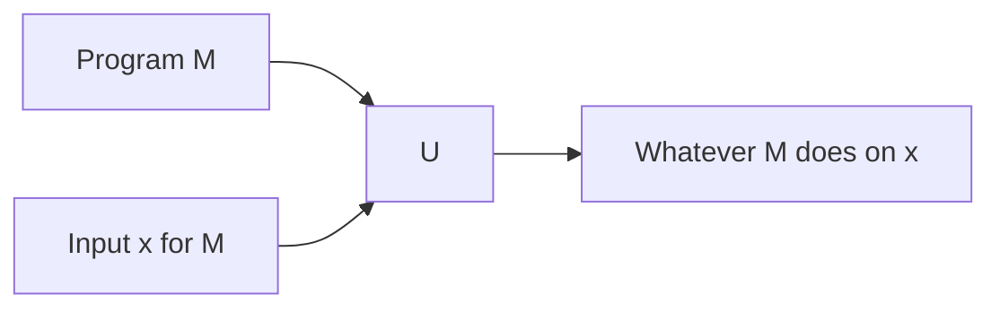
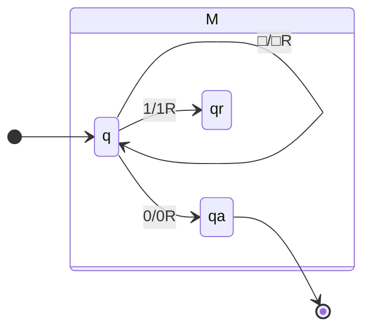

A universal Turing machine defines a formal specification to record a program $M$:



The universal TM $U$ takes as input a program $M$ and a string $x$ and simulates $M$ on $x$.

## Turing Machines as Programs
We can write the following Turing machine:



as the following program:

```
<M> = (q, qa, qr) (0, 1) (0, 1, □)
	((q, q, □/□R)
		(q, qa, 0/0R)
		(q, qr, 1/1R))
	(q) (qa) (qr)
```

This relates to the definition of a Turing machine which is:

$$
(Q,\Sigma,\Gamma,\delta,q_0,q_\text{acc},q_\text{rej})
$$

## Universal Turing Machine
Once we have $M$ we can then pass it into the universal Turing machine $U$:

```
U := On input <M, w>
	Simulate M on input w
	If M enters accept state, accept.
	If M enters reject state, reject.
```

### Acceptance of Turing Machines
Consider we want to make a Turing machine that decides whether a Turing machine accepts a given string:

$$
A_\text{TM}=\{\langle M,w\rangle:M\text{ is a TM that accepts }w\}
$$

From this we can have three results:

* $M$ accepts $w$ - $U$ accepts $\langle M,w\rangle$.
* $M$ rejects $w$ - $U$ rejects $\langle M,w\rangle$.
* $M$ loops on $w$ - $U$ loops on $\langle M,w\rangle$.

Therefore $U$ recognises this language by does not decide $A_\text{TM}$:

* **Recognises** - The set of inputs that make it accept.
* **Decides** - The set that is recognised and halts.

## Terminology
The following terms are sometimes referred to by different names:

* **Recursive Language**:
	* Decidable Problem
	* Total Turing machine.
* **Recursively Enumerable Language**:
	* Semi-decidable problems.
	* Recognisable languages.
	* Sometimes called an undecidable problem.
* **Undecidable Problem**:
	* Unrecognisable language.