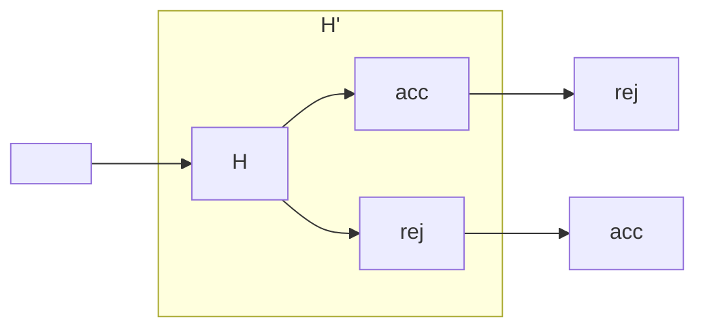
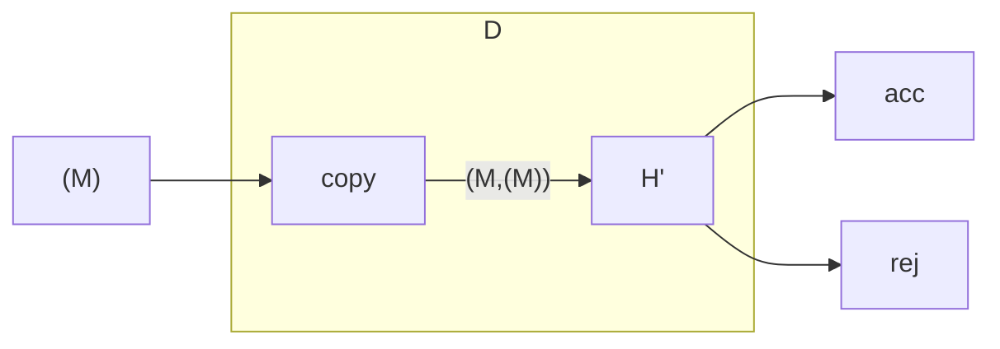

> A TM that decides $A_\text{TM}$ is so powerful that it will destroy itself.

## Proof of Turing's Theorem by Contradiction
Suppose that $A_\text{TM}$ is decidable.

There exists a total TM $H$ that decides $A_\text{TM}$.
{:.info}

It should have the following terminal states:

* Accept:
	* If $M$ accepts $\langle M\rangle$
* Reject
	* If $M$ rejects $\langle M\rangle$
	* If $M$ loops on $\langle M \rangle$
	
Consider that the input string $w=\langle M\rangle$.

Also consider that we have a Turing machine $H'$ that has its outputs swapped:

Also consider that we have a TM called $D$ that does the following:

Consider that $M=D$ is fed into $D$:

* If $D$ accepts $\langle D\rangle$ then $D$ rejects $\langle D\rangle$.
* If $D$ rejects $\langle D\rangle$ then $D$ accepts $\langle D\rangle$.

This is a contradiction and therefore $A_\text{TM}$ is undecidable.

There is also an example of this proof in table form in [the lecture video](https://liverpool.instructure.com/courses/47455/modules/items/1252556).
{:.info}