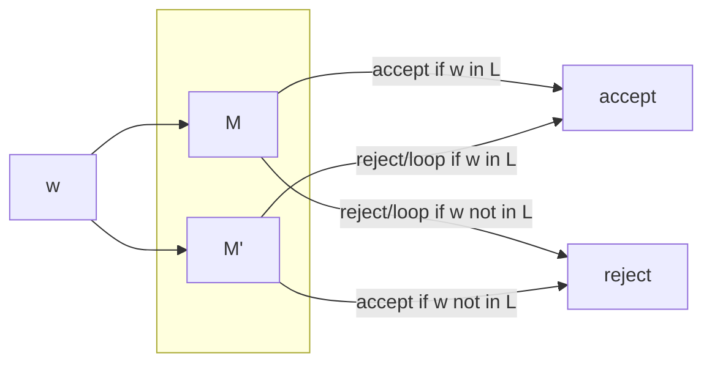

We have found that:

> The language $A_\text{TM}$ is recursively enumerable but not recursive.

Consider that we have a set of languages that are not recognisable:

$$
\begin{aligned}
\overline{A_\text{TM}}=&\{\langle M,w\rangle:M\text{ rejects or loops on input }w\}\\
&\cup\{x:x\text{ does not describe a TM or a valid input}\}
\end{aligned}
$$

The language $\overline{A_\text{TM}}$ is not recursively enumerable.
{:.info}

## Proof of Unrecognisable Languages
> If $L$ and $\overline L$ are both recursively enumerable then $L$ is recursive.

We know that $A_\text{TM}$ is recursively enumerable, so if $\overline{A_\text{TM}}$ was also, then $A_\text{TM}$ would be recursive:

* But Turing's theorem says that $A_\text{TM}$ is not recursive.

This statement is a contradiction.
{:.error}

Consider the following TM for the statement at the top:

This machine will eventually give us an answer as if one machine gets into a loop then the other one is still able to answer.
{:.info}

Let $M=\text{TM}$ for $L$, $M'=\text{TM}$ for $\overline L$.

On input $w$:

1. Simulate $M$ on input $w$. If it accept, accept.
	
	If $M$ loops on $w$, we will never get to step two.
	{:.warning}
1. Simulate $M'$ on input $w$. If it accepts, reject.

### Bounded Simulation
To fix the issue where we don't get to step two we can complete a bounded simulation.

Let $M=\text{TM}$ for $L$, $M'=\text{TM}$ for $\overline L$.

For $t:=0$ to infinity:

1. Do $t$ transitions of $M$ on $w$. If it accepts, accept.
1. Do $t$ transitions of $M'$ on $w$. If it accepts, reject.