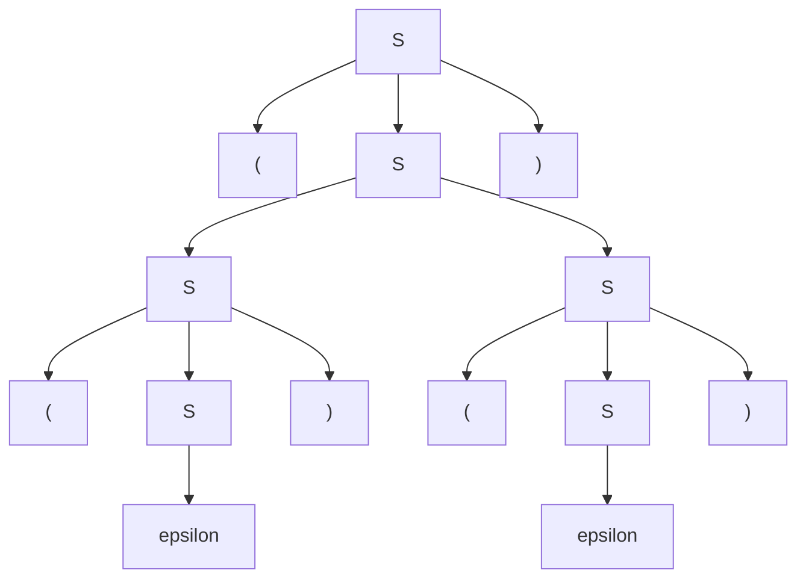

For examples of many context free grammars see [this lecture](https://liverpool.instructure.com/courses/47455/modules/items/1252591)
{:.info}

## Definition

A context-free grammar is given by ($V,\Sigma,R,S$) where:

* $V$ - Finite set of **variables** or **non-terminals**.
* $\Sigma$ - Finite set of **terminals**.
* $R$ - A set of **productions** or **substitution rules** of the form:
	
	$$A\rightarrow\alpha$$
	
	where $A$ is a variable and $\alpha$ is a **string** of variables and terminals.
* $S$ - A variable called the **start variable**.

## Notation & Conventions
For the following set of productions:

* $E\rightarrow E+E$
* $E\rightarrow (E)$
* $E\rightarrow N$

* $N\rightarrow 0N$
* $N\rightarrow 1N$
* $N\rightarrow 0$
* $N\rightarrow 1$

The variables are the **capital letters**. Terminals are any symbol that is not a capital letter. The start variable is taken from the **first production**.

You can write the above in the following short-hand:

* $E\rightarrow E+E\vert(E)\vert N$
* $N\rightarrow 0N\vert1N\vert0\vert1$

## Derivation
Derivation is a sequential application of productions. We don't care what order we use the productions as long as the string is valid. 

We apply the rules until all symbols are terminal.
{:.info}

When applying a single production use the notation:

$$
\alpha\Rightarrow\beta
$$

When the full derivation is reached use:

$$
\alpha\overset*\Rightarrow\beta
$$

Two derivations are different if they use two different rules at any point.
{:.info}

### Context-Free Languages
The languages generated by CFG $G$ is the set of all strings at the end of a derivation:

$$
L(G)=\{w:w\in\Sigma^*\text{ and }S\overset*\Rightarrow w\} 
$$

### Parse Trees
Instead of writing out the productions by hand you can show the derivation as a parse tree:

$$
S\rightarrow SS\vert (S)\vert\epsilon$$
$$

To write a derivation by hand we might write the following:

$$
\begin{aligned}
S&\Rightarrow(S)\\
&\Rightarrow(SS)\\
&\Rightarrow((S)S)\\
&\Rightarrow((S)(S))\\
&\Rightarrow(()(S))\\
&\overset*\Rightarrow(()())
\end{aligned}
$$

We can the represent this as a parse tree:

To read the tree go from left to right and read just the leaves.
{:.info}

One parse tree can represent many different derivations. So matter the order of the same rules applied, you will get the same parse tree.
{:.info}