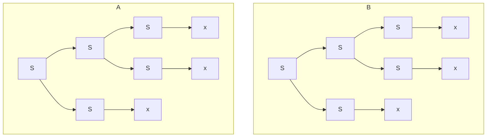
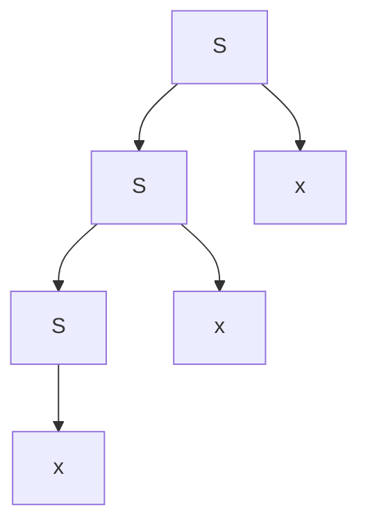

As there could be more than one parse tree from a given input this can cause issues when trying to define the meaning of a string.

## Ambiguity
A CFG is **ambiguous** if some string has more than one parse tree.

Is $S\rightarrow SS\vert x$ ambiguous?

Yes as you could make the following parse trees for the same input:

## Disambiguation
Sometimes you can rewrite the grammar to remove ambiguity:

$$
S\rightarrow Sx\vert x
$$

This gives only the following parse tree for the previous input:

### Precedence
For situations, like mathematical operators, there should be a precedence that should be built into the parse tree.

In situations like this you can create a **new production** that **groups** the parse tree accordingly:

$$
\underbrace{\underbrace{2}_F*\underbrace{(\underbrace{1}_T+\underbrace{\underbrace{2}_F*\underbrace{2}_F)}_T}_F}_E
$$

Here the terms are split into factors $F$ and terms $T$.
{:.info}

This can be written as the following productions:

$$
\begin{aligned}
E&\rightarrow T\vert E+T\\
T&\rightarrow F\vert T*F\\
F&\rightarrow(E)\vert1\vert2
\end{aligned}
$$

## Completeness
Disambiguation is **not always possible** because:

* There exists **inherently ambiguous** languages.
* There is **no general procedure** for disambiguation.

In programming languages, ambiguity comes from precedence rules, and we can deal with it like in the previous example.