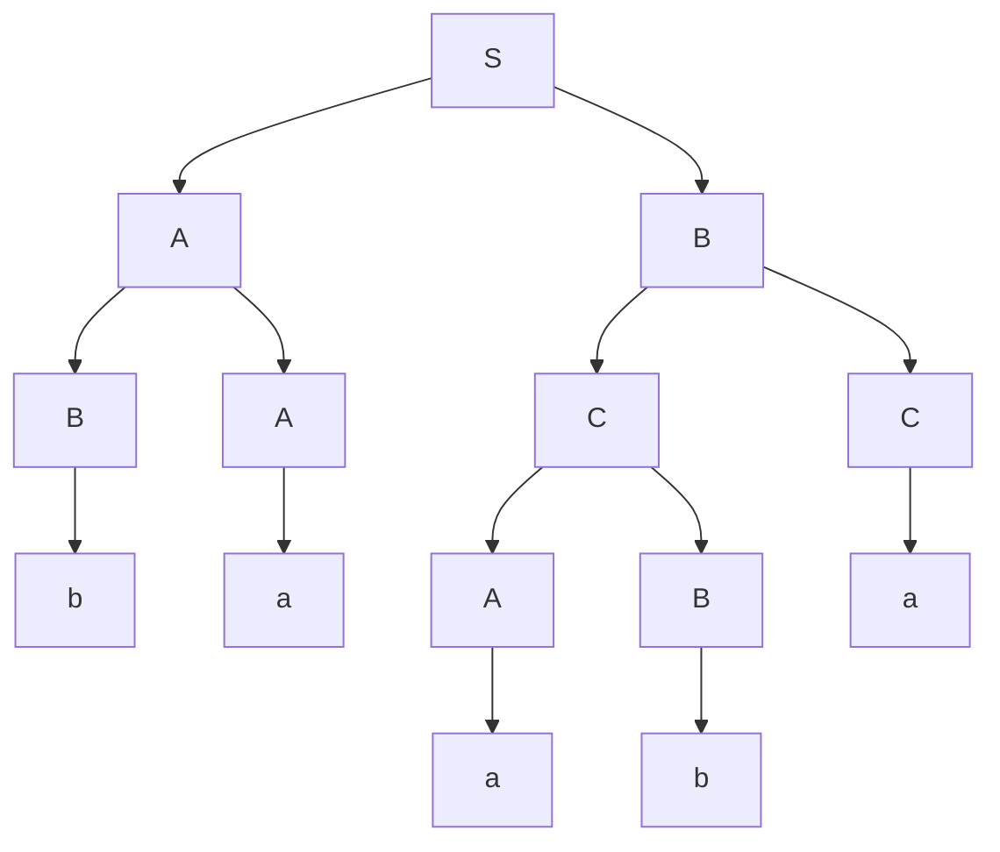

To complete this algorithm the grammar must be in Chomsky Normal Form, including no $\epsilon$ or unit productions.
{:.warning}

## Method
This method uses a table like so:

| $1k$ | | | |
| --: | --: | --: | --: |
| $\vdots$ | $\vdots$ | | |
| 12 | 23 | | |
| 11 | 22 | | $kk$ |
| $x_1$ | $x_2$ | $\cdots$ | $x_k$ | 

Where $x_k$ is a symbol from the input sting at position $k$.

```
For all cells in last row
	If there is a production A -> xi
		Put A in table cell ii
For cells st in other rows (going bottom-up)
	If there is a production A -> BC
		where B is in cell sj and C is in cell (j + 1)t
	Put A in cell st
```

Cell $st$ remembers **all variables able to generate** sub-string $x_s\ldots x_t$.
{:.info}

### Example
Consider that we have the following language and input string:

$$
\begin{aligned}
S&\rightarrow AB\vert BC\\
A&\rightarrow BA\vert a\\
B&\rightarrow CC\vert b\\
C&\rightarrow AB\vert a\\
\hline
x&=\text{baaba}
\end{aligned}
$$

Going up the table, we should write **all the productions** that can generate the previous row (from the bottom up):

| $\underline S,A,C$ (baaba) | | | | |
| :-- | :-- | :-- | :-- | :-- |
| - (baab) | $S,A,C$ (aaba) | | | |
| - (baa) | $B$ (aab) | $\underline B$ (aba) | | |
| $S,\underline A$ (ba) | $B$ (aa) | $S,\underline C$ (ab) | $S,A$ (ba) | |
| $\underline B$ (b) | $\underline A,C$ (a) | $\underline A,C$ (a) | $\underline B$ (b) | $A,\underline C$ (a) |
| b | a | a | b | a |

Key: `<productions that can make the sub-string> (<sub-string>)`
{:.info}

Productions in the parse tree are underlined.
{:.info}

* For each level you go up you should increase the string length that you are generating:
	1. String length of 1 starting directly underneath.
	1. String length of 2 starting directly underneath.
* If you are analysing a sub-string you have already done then you can just copy the answer.

#### Parse Tree Reconstruction
If the input can be generated then the start symbol will be in the top left (in this case $S$).

* To make the parse tree, start with the start symbol and connect edges between productions in $S$ that can create the whole string.
* Keep iterating over the productions until you reach non-terminals at the end of the tree

