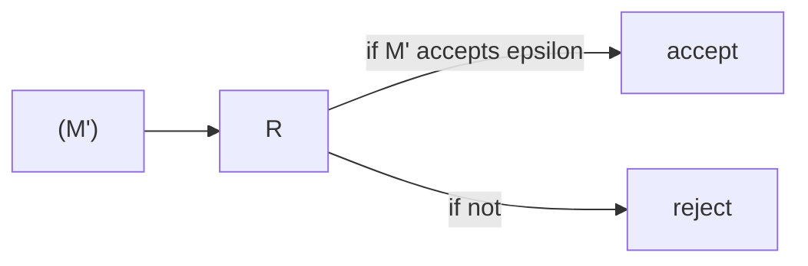
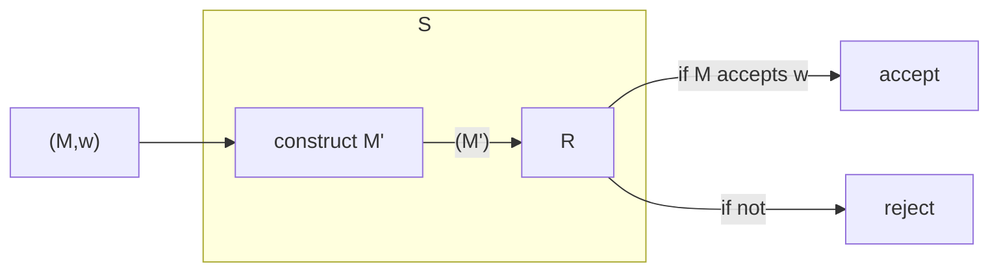

This is a common technique that can be used to show how hard a problem is or how to reduce a hard problem to a simpler ones.

As we know that $A_\text{TM}$ is not recursive we can use that to prove that a language $L$ is not recursive:

* If some TM $R$ decides $L$ then using $R$ we can build another TM $S$ so that $S$ decides $A_\text{TM}$

This is impossible, as $A_\text{TM}$ is not recursive. This proves the theory by contradiction.
{:.info}

## Reducability Example
### Recursively Enumerable Languages
Consider that we have the following language:

$$
\text{AEPS}_\text{TM}=\{\langle M\rangle\vert M\text{ is a TM that accepts input }\epsilon\}
$$

To know if $M$ accepts $\epsilon$ we will have to simulate it:

* This means that we may end up in a loop as $M$ is a Turing machine.

This is just a guess but it still needs to be proved.
{:.warning}

We can complete the proof by completing the reduction:

We can make a Turing machine $M'$ that:

* On input $z$ (ignore),
* Simulate $M$ on input "w":
	* If $M$ accepts $w$, accept.
	* Otherwise, reject.

We can then make a Turing machine $S$ that has the following actions:

* On input $\langle M,w\rangle$:
	* Construct the following TM $M'$:
		* On input $z$ (ignore),
		* Simulate $M$ on input "w":
			* If $M$ accepts $w$, accept.
			* Otherwise, reject.
	* Run $R$ on input $\langle M'\rangle$ and output its answer.

If this machine $S$ exists then $S$ accepts $\langle M,w\rangle$ if and only if $M$ accepts $w$. This means that $S$ decides $A_\text{TM}$, which is impossible.

Therefore this language is **undecidable** but still recursively enumerable.
{:.info}

### Undecidable Languages
Consider that we have the following Turing machine:

$$
E_\text{TM}=\{\langle M\rangle\vert M\text{ is a TM that accepts no input}\}
$$

We need to show:

* If $E_\text{TM}$ can be decided by some TM $R$
* then $\text{SOME}_\text{TM}$ can be decided by another TM $S$.

Where:

$$
\text{SOME}_\text{TM} = \{\langle M\rangle\vert M\text{ is a TM that accepts some input}\}
$$

Therefore consider $S$:

* On input $\langle M\rangle$ where $M$ is a TM:
	* Run $R$ on input $\langle M\rangle$:
		* If $R$ accepts, reject.
		* If $R$ rejects, accept.

Then $S$ decides $\text{SOME}_\text{TM}$ is a contradiction, proving that this language is **undecidable**.
{:.info}

We know if $L$ and $L'$ are both recursively enumerable then they are both recursive:

* As they are both opposite and aren't recursive then they must both be unrecognisable.