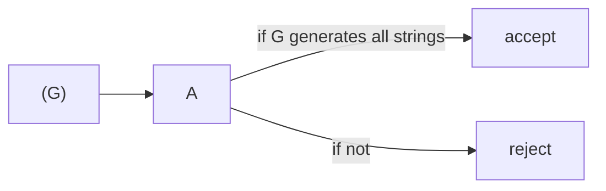
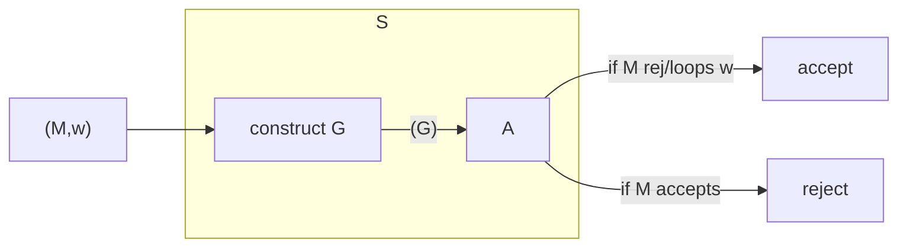

We currently know the decidability of the following problems:

| Decidable | Undecidable |
| :-- | :-- |
| DFA $M$ accepts $w$ | TM $M$ accepts $w$ |
| CFG $G$ generates $w$ | TM $M$ halts on $w$ |
| DFAs $M$ and $M'$ accept the same inputs | TM accepts some input |
| | TM $M$ and $M'$ accept the same inputs |

## Computation Histories as Strings
If $M$ halts on "w", the computation history of $(M,w)$ is the sequence of configurations $C_1,\ldots,C_i$ that $M$ goes through on input $w$.

The computation history can be written as a string `hist` over alphabet $\Gamma\cup Q\cup\\{\\#\\}$:

* Accepting History - $q_\text{acc}$ occurs in `hist`.
* Rejecting History - $q_\text{rej}$ occurs in `hist`.

---

## Undecidable CFG Example
Consider the following CFG:

$$
\text{ALL}_\text{CFG}=\{\langle G\rangle\vert G\text{ is a CFG that generates all strings}\}
$$

This language is **undecidable**.
{:.info}

We can argue that if $\text{ALL}\_\text{CFG}$ is recursive, then so is $\overline{A\_\text{TM}}$.

...

I'm not too sure about what the method is completing in this example. Ask about [slide 137](https://liverpool.instructure.com/courses/47455/files/6140982?module_item_id=1252651) if it comes up in the tutorials.
{:.info}

---