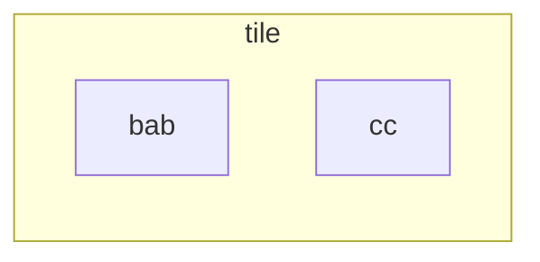

## Post Correspondence Problem
Given an infinite set of tiles the the following form:



This is like a domino but the top and bottom could also include the empty string.
{:.info}

### Undecidability of PCP

$$
PCP = \{\langle T\rangle \vert T \text{ is a collection of tiles that contain a top-bottom match}\}
$$

This language is:

* Not Recursive
* Recursively Enumerable:
	* A Turing machine would just go on forever until a match is found.
	
## Ambiguity of CFGs

$$
\text{AMB}=\{G\vert G \text{ is an ambiguous CFG}\}
$$

This language is:

* Not Recursive
* Recursively Enumerable
	* You can only solve for ambiguous grammars. 

We can argue that:

> If $\text{AMB}$ is recursive, then so is $\text{PCP}$.

### Solving Decidability of Ambiguous CFGs with the PCP
We need to find a way to convert the one problem to the other:

$$
T(\text{collection of tiles})\rightarrow G(\text{CFG})
$$

* If $T$ can be matched, then $G$ is ambiguous.
* If $T$ cannot be matched, then $G$ is unambiguous.

1. Number the tiles:

	```mermaid
	flowchart LR
	subgraph 1
	direction LR
	bab
	cc
	end
	subgraph 2
	direction LR
	c
	ab
	end
	subgraph 3
	direction LR
	a
	ab2[ab]
	end
	1 -.- 2 -.- 3
	```
1. Generate the terminals from the tile numbers and the distinct letters on the tiles.
	
	Terminals: `a, b, c, 1, 2, 3`
1. There are always three variables:
	* $S$ - Start
	* $T$ - Top
	* $B$ - Bottom
1. For the productions we always have:
	* $S\rightarrow T\vert B$
	
	and then for **each** of the tiles we have productions like so:
	
	* $T\rightarrow \text{bab}T1$
	* $B\rightarrow \text{cc}B1$
	* $T\rightarrow \text{bab}1$
	* $B\rightarrow \text{cc}1$
	
If the top row and bottom row **match** then there are **multiple derivations** for the same string:

* $S\Rightarrow T\Rightarrow\text{bab}T1\Rightarrow\text{babc}T21\Rightarrow\text{babcc}221$
* $S\Rightarrow B\Rightarrow\text{cc}B1\Rightarrow\text{ccab}B21\Rightarrow\text{ccabab}221$

These two don't produce the same string. Therefore, there is no match and there is only one derivation. Hence the parse tree is not ambiguous.
{:.info}