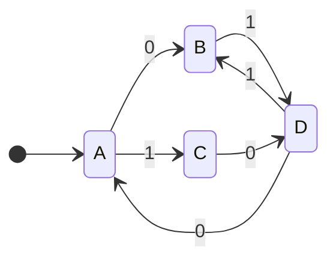

The questions for this tutorial are [available here](https://liverpool.instructure.com/courses/47455/files/6141034/download?download_frd=1).

## Powersets
The powerset is the set of all subsets. The number of elements in the powerset is: $2^n$.

1. $\\{\emptyset\\}, \\{a\\}, \\{b\\},\\{a,b\\}$
1. $\\{\emptyset\\}, \\{0\\},\\{1\\},\\{2\\},\\{0,1\\},\\{0,2\\},\\{1,2\\},\\{0,1,2\\}$
1. $\\{\emptyset\\}, \\{z\\}$
1. $\\{\emptyset\\}, \\{1\\},\\{3\\},\\{1,3\\}$
1. $\\{\emptyset\\}, \\{0\\},\\{2\\},\\{0,2\\}$
1. $\\{\emptyset\\}$

## Kleene Start Operation
This is all the different strings that can be produced with the characters in the alphabet. This includes the empty-string.

1. This is all binary strings including the empty-string:
	* $\\{0,1\\}^*$
1. This is any number of the letter `a` including the empty-string:
	* $a^n\vert n\geq 0$
1. This is only the empty-string:
	* $\\{\epsilon\\}$

## The $+$ Operation
If we have the option to choose an element we must choose at least one. This is the same as the Kleene star operation but without the empty-string.

For $\\{0,1\\}^+$ this would be formally written as:

$$\\{0,1\\}\\{0,1\\}^*$$

One element followed by any number of elements.
{:.info}

## Alphabets

1. $\\{0,1\\}$
1. $\\{a\\}$
1. $\\{\epsilon\\}$

## Complement Langugages
Assume that we have $\\{0,1\\}^*$ and remove everything under the line:

1. $\\{0,1\\}^*-\\{010,101,11\\}$
1. $\\{110\\}$
1. $\\{\epsilon\\}$

## Following DFAs



1. `0111010` - Accept
1. `010011` - Reject
1. `100` - Reject
1. `11001` - Reject
	
	If we are given a transition that doesn't exist, this leads to a "dead" state. If it is not drawn acknowledge it's existence.
	{:.info}

## Creating DFAs


1. $L1$ is a set of all words containing exactly three occurrences of $a$.

	```mermaid
	stateDiagram-v2
	direction LR
	[*] --> A
	A --> B:a
	A --> A:b
	B --> C:a
	B --> B:b
	C --> D:a
	C --> C:b
	D --> D:b
	D:D
	```
1. $L2$ is a set of all words containing at least three occurrences of $a$.
	
	```mermaid
	stateDiagram-v2
	direction LR
		[*] --> A
	A --> B:a
	A --> A:b
	B --> C:a
	B --> B:b
	C --> D:a
	C --> C:b
	D --> D:a, b
	D:D
	```
	
1. $L3$ is a set of words containing the sub-string $aaa$.

	```mermaid
	stateDiagram-v2
	direction LR
		[*] --> A
	A --> B:a
	A --> A:b
	B --> A:b
	C --> A:b
	B --> C:a
	C --> D:a
	D --> D:a,b
	D:D
	```
