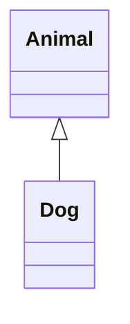

## Inheritance

* c++ has **access modifiers** on inheritance.
* There are **no interfaces** like in Java.

Basic inheritance has the following syntax:

```c++
class Dog : public Animal();
```

which represents the following:



The access modifiers change the access modifiers of **inherited methods** etc. `public` makes **no change**.
{:.info}

### Polymorphism

```c++
#include <iostream>
using namespace std;
class Animal {
	public:
	void makeNoise() { cout << "Grunt"; }
};
class Dog : public Animal {
	public:
	void makeNoise() { cout << "Woof"; }
};
```


```c++
int main()
{
	Dog rover;
	Animal* pet = &rover;
	pet->makeNoise();
}
```

This will make the `Grunt` noise of `Animal`.
{:.warning}

### Virtual Polymorphism
We can **override methods** properly like so:

```c++
#include <iostream>
using namespace std;
class Animal {
	public:
	virtual void makeNoise() { cout << "Grunt"; }
};
class Dog : public Animal {
	public:
	void makeNoise() { cout << "Woof"; }
};
```

The keyword here is `virtual`.
{:.info}

### Initialisation
Memory for the parent class is always initialised before the memory **before the child**.

To pass data from the child to the parent constructor, we would do the following:

```c++
#include <iostream>
using namespace std;
class Animal {
	protected:
	int weight;
	string name;
	public:
	Animal(int w, string n) : weight(w), name(n) {}
	virtual void output() {
	cout << name << " weighs " << weight << endl; }
};
```

```c++
class Dog : public Animal {
	public:
	Dog(int w, string n) : Animal(w,n) {}
};
int main() {
	Dog rover(5, “Rover");
}
```

### Slicing
We can turn a child object into it's parent by doing the following:

```c++
class Cat : public Animal {
private:
    int lives;
public:
    Cat(int w, string n, int v) : Animal(w, n) {
        lives = v;
    }
    void output() {
        cout << name << " weighs " << weight << " and has ";
        cout << lives << " lives" << endl;
    }
};
```

```c++
int main() {
    Cat fluffy(5, "Fluffy", 9);
    Animal pet = fluffy;
    pet.output();
}
```

This will **remove any attributes of the child**.

### Accessing a Child Through the Parent
We can have a parent pointer that points to a child object like so:

```c++
int main() {
    Cat grumpy(5, "Grumpy Cat", 9);
    Animal* pet = &grumpy;
    cout << ((Cat*)pet)->getLives(); // This will work fine
}
```

### Passing Object Examples
We have the following methods ob passing objects to functions:

1. **Directly** by copying the object:

	```c++
	void eat(Animal toBeEaten) {
		weight += toBeEaten.weight;
		toBeEaten.weight = 0;
	}
	```
1. Passing a **pointer** (must use `&`):

	```c++
	void eat(Animal* toBeEaten) {
		weight += toBeEaten->weight;
		toBeEaten->weight = 0;
	}
	```
1. Pass by **reference**:

	```c++
	void eat(Animal& toBeEaten) {
		weight += toBeEaten.weight;
		toBeEaten.weight = 0;
	}
	```

### Permanent Objects
To keep objects once we leave their scope we can allocate memory on the heap with the following syntax:

```c++
Dog* myDog = new Dog(10, "Rover");
Cat* myCat = new Cat(5, "Grumpy", 9);
```

* This creates a new pointer where we will have to use `->` to access methods and so on.

To free the memory after we have finished with an object we can `delete` it:

```c++
delete(myDog); // this calls the destructor for Dog
```

## Overloading
* Two functions can have the same name if they have different parameters.
	
	This is most often used with constructors.
	{:.info}

```c++
#include <iostream>
#include "Animal.h"
#include "Dog.h"
using namespace std;
void name(Animal *a) {
    cout << "Animal";
}
void name(Dog *d) {
    cout << "Dog";
}
int main()
{
    Dog rover;
    Animal *pet = &rover;
    name(rover);
    name(pet);
}
```

### Constructor Overloading
We can write the following header file:

```c++
class Ruler {
public://public right now to make it easier to demonstrate
    int feet;
    int inches;
public:
    Ruler(int i);
    Ruler(int f, int i);
};
```

and implement our constructors like so:

```c++
#include "Ruler.h"
Ruler::Ruler(int f, int i) {
	feet = f + i / 12
	inches = i % 12;
}
Ruler::Ruler(int i) : Ruler(0,i) {}
```

### Operator Overloading
To add our new measurement with the `+` operator we can overload the `+` operator. We declare this as a member function of a class:

```c++
Ruler operator+(const Ruler& ru);
```

and implement this like so:

```c++
Ruler Ruler::operator+(const Ruler& ru) {
    Ruler temp(this->feet + ru.feet, this->inches + ru.inches);
    return temp;
}
```

We can then add `Ruler` objects using `+`.

We can also do a similar thing for equality operators.
{:.info}