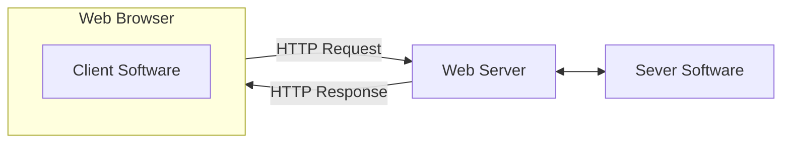

## Web-Based Application Interfaces
Web-based applications are **client-server** applications where:

1. The **client software**, consisting of a user interface and client-side logic of the application, run in a web browser.
1. Static aspects of a user interface are realised using **HTML**.
1. The client software incorporates **user inputs** into a HTTP request that it **sends to a web server** to retrieve information or to update parts of itself. 
1. The web server uses a program, the **server software**, to compute an HTTP response that it sends back the web browser.



## HTML
### Elements

* A **HTML element** is an individual component of a HTML document. 
* Most element consist of a **start tag** and a matching **end tag** with some content in-between.

The general form of a start tag is like so:

```html
<tagName attrib1="value" attribN="valueN">
```

and an end tag looks like the following:

```html
</tagName>
```

#### Void Elements
These are HTML elements that only have a starting  tag such as:

* `area`
* `base`
* `br`

Since they have no content, they **cannot** be nested.
{:.info}

The start tag of **void elements** can be made **self-closing** by ending the tag with `/>` instead of `>` like so:

```html
<br/>
```

### Documents
An HTML5 document begins with a `DOCTYPE` declaration and an `html` element like so:

```html
<!DOCTYPE html>
<html>
</html>
```

It is recommended that the start tag **specifies the language** used in the document:

```html
<html lang="en-GB">
```

### Forms
Forms allow users to enter data which can be sent to a web server. It has several optional attributes, including:

| Attribute | Description |
| :-- | :-- |
| `action` | URL to use for form submission. |
| `method` | HTTP method to use for form submission (`get` or `post`). |
| `enctype` | The encoding type to use for form submission. |
| `novalidate` | Form is not validated during submission. |

You would use these attributes like so:

```html
<form action="https://sam.csc.liv.ac.uk/COMP/Calendar.pl" method="post" enctype="text/plain">
</form>
```

#### Input
The input element represents a field that allows the user to **enter data** of a certain type. 

The input element is a **void element**.
{:.info}

The `type` attribute of an input element determines what type of data can be entered and in what form. 

| Value of Type | Data Type | Form Control |
| :-- | :-- | :-- |
| `text` | Text with no line breaks | Text field. |
| `number` | Floating-point number. | Text field or spinner. |
| `password` | Password | Text field with obscured input. |
| `button` | | Button |
| `submit` | Initiates form submission. | Button |
| `reset` | Resets the form. | Button |

You can use them like so:

```html 
<input type="text">
<input type="reset">
```

Common attributes of input elements include the following:

| Attribute | Description |
| :-- | :-- |
| `id` | A unique id used to identify the element within the document. |
| `name` | A unique name used by the form processor to access input. |
| `autofocus` | Automatically focus on this form control when the page is loaded. |
| `disabled` | Whether the form control is disabled. |
| `required` | Whether the form control is required to have a non-empty value for form submission. |

#### Labels
In order for a form to be readable, each form control should be accompanied by an indication of what it is. A **label element is a caption** the can be associated with a specific form control. 

It can be used in the following ways:

```html
<label for="s1">Surname:</label>
<input type="text" name="surname" id="s1">
```

```html
<label>
	First names(s):
	<input type="text" name="first" id="f1">
</label>
```

#### Form Example
You can put this all together using the following HTML which would render like so:

```html
<form action="process.py">
	<label for="s1">Surname:</label>
	<input type="text" name="surname" id="s1">
	<label>
		First Name:
		<input type="text" name="first" id="f1">
	</label>
	<label>
		Student ID:
		<input type="number name="studentid" id="sid" min="190000000" max="999999999">
	</label>
	<input type="submit">
</form> 
```

---

<form action="">
	<label for="s1">Surname:</label>
	<input type="text" name="surname" id="s1">
	<label>
		First Name:
		<input type="text" name="first" id="f1">
	</label>
	<label>
		Student ID:
		<input type="number" name="studentid" id="sid" min="190000000" max="999999999">
	</label>
	<input type="submit">
</form>

---

A string composed of `name=value` pairs will be sent to the `action` program.
{:.info}

**HTML encoding** is used on strings.
{:.warning}

#### Select
A select element represents a drop-down menu with pre-defined options. They can be made with the following HTML and render like so:

```html
<label for="m1">Select a module:</label>
<select name="module" id="m1">
	<option value="COMP201">COMP201: Software Engineering I</option>
	<option value="COMP207">COMP207: Database Development</option>
	<option value="COMP211">COMP211: Computer Networks</option>
</select>
```

---

<label for="m1">Select a module:</label>
<select name="module" id="m1">
	<option value="COMP201">COMP201: Software Engineering I</option>
	<option value="COMP207">COMP207: Database Development</option>
	<option value="COMP211">COMP211: Computer Networks</option>
</select>

---

* By default, the **first option** is selected.
* If the selection is not changed and the user activates the submit button then `module=COMP201` is sent to the server.
* If the default element has an **empty value** then the user is forced to make a choice.

## Common Gateway Interface (CGI)
This is a standard method for web server to use an external application, a CGI program, to **dynamically generate web pages**.

1. A web client generates an HTTP request and sends it to a web server.
1. The web server selects a CGI program to handle the request, converts the HTTP request to a CGI request and executes the program.
* The CGI program then processes the CGI request and the server passes the program's response back to the client.

[^CGI]

[^CGI]: Common gateway interface illustration - https://www.oreilly.com/library/view/cgi-programming-on/9781565921689/04_chapter-01.html

This lecture is to be continued.
{:.error}