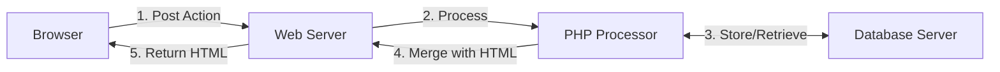

## Web Applications using PHP



## PHP & Forms
We can use something like the following to call a php script with the restult of a form:

```html
<form action='process.php' method='post'>
	...
</form>
```

The following **information** is available to PHP scripts:

* Information about the PHP **environment**. 
* Information about the **web-server** and **client request**.
* Information store in **files** and **databases**.
* **Form Data**
* **Cookie** / **Session** Data
* Date & Time ([date formatting](https://www.php.net/manual/en/datetime.format.php)):
	
	```php
	date('H:i l, j F Y')	// 12:20 Thursday, 8 March 2022
	time() // Unix time in seconds
	```

## PHP Environment

```
phpinfo([part])
```

Displays information abou the PHP installation and EGPCS data (environment, GET, POST, cookie and server data).

* The optional `part` argument can take the following options to only display certain information:
	* `INFO_GENERAL` - The configuration, `php.ini` location, build date and web-server.
	* `INFO_CONFIGURATION` - Local and master vales for PHP directives.
	* `INFO_MODULES` - Loaded modules.
	* `INFO_VARIABLES` - All EGPCS data.
	
### Manipulating the PHP Configuration
The following function can be used to access and change the configuration of PHP from **within** the PHP script:

| Function | Description |
| :-- | :-- |
| `ini_get_all()` | Returns all the registerd configuration options. |
| `ini_get(option)` | Returns the value of the configuration option `option`.
| `ini_set(option, value)` | Sets the value of the given configuration `value`. The configuration `option` will keep this new value during the script's execution and will be restored after. |
| `ini_restore(option)` | Restores a given configuration option to its original value. |

We can use this to show errors in the HTML output:

```html
<html lang='en-GB'>
<head></head>
<body>
<? php
	ini_set('display_errors', 1);
	error_reporting(E_ALL | E_STRICT); // choose one
	echo '<p>The value of 1 divided by 0 is ' , 1/0 , '</p >';
?>
</body>
</html>
```

### Server Variables
The superglobal `$_SERVER` array stores information about the **web-server** and the **client request**.

A full list of keys are available here: [http://php.net/manual/en/reserved.variables.server.php](http://php.net/manual/en/reserved.variables.server.php).
{:.info}

### Form Data
The form data is passes to a PHP script via three superglobal arrays:

| Variable | Description |
| :-- | :-- |
| `$_POST` | Data from the POST client requests. |
| `$_GET` | Data from the GET client requests. |
| `$_REQUEST` | Combined data from POST and GAT client requests. Equivalent to `cgi.FieldStorage()` in Python CGI. |

We can access data by the `name`:

```php
$_REQUEST['username']
```

## String Functions
The following functions could be useful when processing form data:

| Function | Description |
| :-- | :-- |
| `strtolower(str)` | Returns a string will all alphabetic characters in `str` converted to lower-case. |
| `substr(str, start [,length])` | Returns the portion of the string `str` starting at position `start ` and consisting of at most `length` characters. If `start` is **negitive**, the returned string will start at the `start`'th character from the **end** of the string.
| `date(format, [,timestamp)` | Returns a string formatted according to the given format string `format` using the given timestamp or the current time if no timestamp is given. |

## HTML Form Example
There is a full example for generating and processing a HTML form using PHP [starting at slide 14](https://liverpool.instructure.com/courses/46944/files/6811253?module_item_id=1325178)


The following form is used:

---

<form action='generate.php' method='post'>
	<label>Enter your full name:
		<input type='text' name='fullname'>
	</label>
	<label>Select your year of registration:
		<select name='year' required>
			<option value=' '>----</option>
			<option>2022</option>
		</select>
	</label>
	<input type='submit' name='submit' value='Generate'>
</form>

---

## POST, Redirect, GET (PRG)
As we used a POST request, if a person **refreshes** the page, this can resend the request giving unwanted side effects.

This design pattern requires that we:

* Redirect to a results page after a POST request.

There is an example of extending the original form with this functionality [starting at slide 21](https://liverpool.instructure.com/courses/46944/files/6811253?module_item_id=1325178)
{:.info}