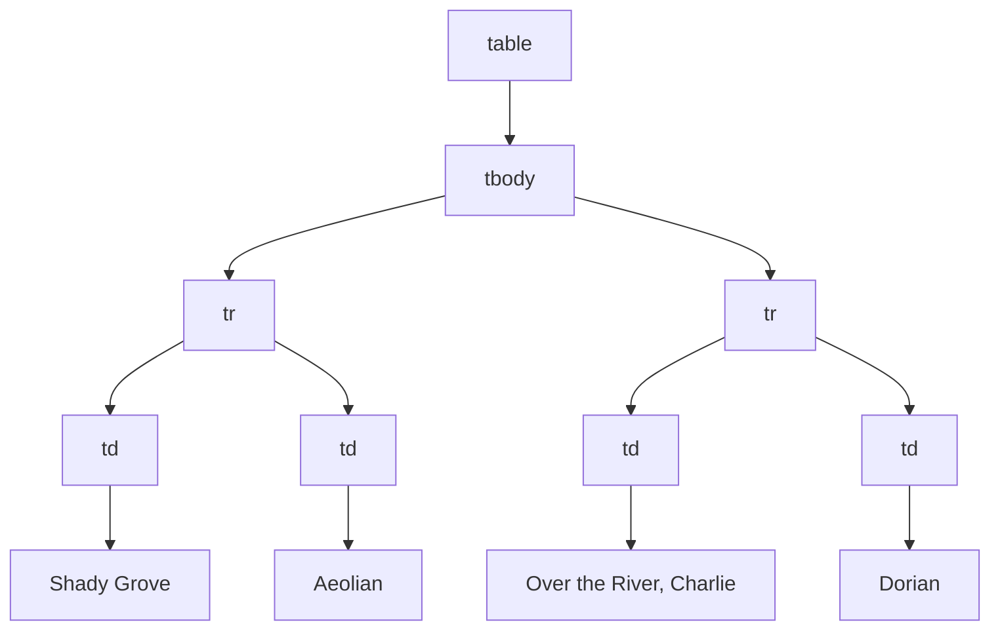

## Window Object
A `window` object represents an open window in a browser. If a document contains **frames**, there there is:

* One window object, for the HTML document.
* One additional window object for each frame accessible via a `window.frames` array.

Whenever an object or property is referenced in a script without an object name and dot prefix it is assumed to be a member of the **`window` object**.
{:.info}

`window` has the following properties:

| Property | Description |
| :-- | :-- |
| `document` | The document object for the window. |
| `history` | The history object for the window. |
| `location | The current URL of the window. |
| `navigator` | The web browser object for the window. |
| `opener` | Reference to the window that created the window. |
| `innerHeight` | Inner height of a window's content area. |
| `innerWidth` | Inner width of a window's content area. |
| `closed` | A boolean value indicating whether the window is still open. |

### Navigator Object
The properties of the `navigator` object include:

| Property | Description |
| :--  | :-- |
| `navigator.appName` | The web browser's name. |
| `navigator.appVersion` | The web browser's version. |

This can be used to load different style sheets depending on browser version. 
{:.info}

### Window Object Methods
Methods provided by the `window` object include:

```javascript
open(url, name[, features])
```

Opens a new browser window/tab:

* Returns a reference to a window object.
* `url` is the URL to access in the new window.

	This can be an empty string.
	{:.info}
* `name` is a name given to the window for later reference.
* `features` is a string that determines various window features.

We can use this like so:

```javascript
var newWin = window.open(...)
newWin.document.write('<html>...</html>')
```

There are also the following methods:

| Method | Description |
| :-- | :-- |
| `close()` | Closes a browser window or tab. |
| `focus()` | Give focus to a window. |
| `blur()` | Removes focus from a window. |
| `print()` | Sends the contents of the current window to the printer. |

### Dialog Boxes
The `window` object provides predefined methods for the handling of dialog boxes.

#### `alert()`
```
alert(message_string)
```

* The box contains an OK button that the user will have to click for execution to resume.

---

<button onclick="alertFunction()">Alert</button>

<script>
function alertFunction() {
  alert("Alert");
}
</script>

---

#### `confirm()`
```
bool confirm(message_string)
```

* The box contains two buttons: Cancel and OK.
* The function returns `true` if the user selects OK and `false` otherwise.

---

<button onclick="confirmFunction()">Confirm</button>

<script>
function confirmFunction() {
  confirm("Confirm");
}
</script>

---

#### `prompt()`
Creates a dialog box displaying `message_string` and an input field:

```
string prompt(message_string[, default])
```

* `default` will be shown in the input field, if given.
* The box contains two buttons: OK and Cancel.
* If the users selects OK then the current value entered in the input field is returned as a string, otherwise `null` is returned.

---

<button onclick="promptFunction()">Prompt</button>

<script>
function promptFunction() {
  prompt("Prompt", "Default Value");
}
</script>

---

To convert from a string to other datatypes we can use the following functions:

* `parseInt(string[, base])`
* `parseFloat(string)`
* `Number(string)`

## Input Validation
There is an example of user input validation at:

* [https://cgi.csc.liv.ac.uk/~ullrich/COMP284/examples/jsValidate.html](https://cgi.csc.liv.ac.uk/~ullrich/COMP284/examples/jsValidate.html)

The code is also available [staring at slide 15](https://liverpool.instructure.com/courses/46944/files/6611965?module_item_id=1325209).
{:.info}

## Document Object Model (DOM)
We can use the `document` object to interact with the DOM.

The following HTML:

```html
<table>
	<tbody>
		<tr>
			<td>Shady Grove</td>
			<td>Aeolian</td>
		</tr>
		<tr>
			<td>Over the River, Charlie</td>
			<td>Dorian</td>
		</tr>
	</tbody>
</table>
```

is converted into the following DOM:
 


### Accessing via Object Methods
We can access objects in the DOM by using the tree:

```javascript
var first = document.firstChild;
var firstChild = first.childNodes[1];
first.removeChild(firstChild);
first.data = "Hello";
```

### Accessing via Names
So that we don't have to use `child` and `parent` selectors, we can give objects names:

```javascript
<div>
	<form name="form1" action"">
		...
	</form>
</div>
```

We can then access them like so:

```javascript
document.div.form1
```

The path of an object could change when editing the DOM so this method isn't always too useful.
{:.info}

### Accessing via IDs
IDs are a more reliable way to access objects. We can assign them like so:

```javascript
<div>
	<form id="form1" action"">
		...
	</form>
</div>
```

and find that object that they are referring to like so:

```javascript
document.getElementById("form1")
```

we can then get the **value** of this object like so:

```javascript
document.getElementById("form1").value
```

### Manipulating HTML elements
There is an example of manipulating HTML elements using JavaScript here:

* [https://cgi.csc.liv.ac.uk/~ullrich/COMP284/examples/jsBG.html](https://cgi.csc.liv.ac.uk/~ullrich/COMP284/examples/jsBG.html)

The code is also available [staring at slide 23](https://liverpool.instructure.com/courses/46944/files/6611965?module_item_id=1325209).
{:.info}