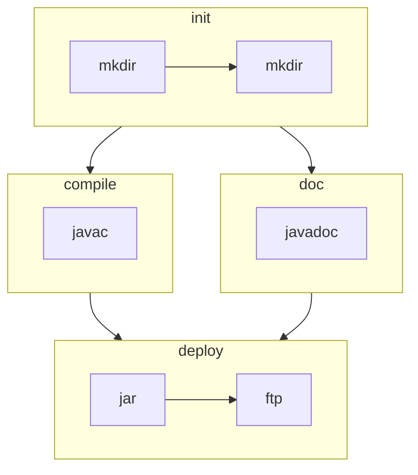

## Ant Terminology
In Ant, each **build file** contains one **project**. A large project may include:

* Smaller **sub-projects**.
* A **master build file** that can coordinate the builds of sub-projects.

Each Ant **project** contains multiple **targets** that represent stages in the build process. These could be:

* Compiling
* Testing
* Deploying to a Server

**Targets** can have **dependencies** so that you can control the order of operations. 

Each **target** is composed of a number of **tasks** that complete the actual work.

## Ant Example
The dependency tree of an Ant project may look something like the following:



This tree can be realised in the following XML that should be named `build.xml`:

```xml
<?xml version="1.0" encoding="UTF-8"?>
<project name="OurProject" default="deploy">
   <target name="init">
      <mkdir dir="build/classes" />
      <mkdir dir="dist" />
   </target>
   <target name="compile" depends="init">
      <javac srcdir="src" destdir="build/classes" includeAntRuntime="no" />
   </target>
   <target name="doc" depends="init">
      <javadoc destdir="build/classes" sourcepath="src" packagenames="org.*" />
   </target>
   <target name="deploy" depends="compile,doc">
      <jar destfile="dist/project.jar" basedir="build/classes" />
      <ftp server="${server.name}" userid="${ftp.username}" password="${ftp.password}">
         <fileset dir="dist" />
      </ftp>
   </target>
</project>
```

The `depends` attribute defines the tree.
{:.info}

## Property Files
We can include property files with additional parameters like so:

```
$ ant -propertyfile ftp.properties
```

These files are structured like so:

```
server.name=ftp.texas.austin.building7.eblox.org
ftp.username=kingJon
ftp.password=password
```