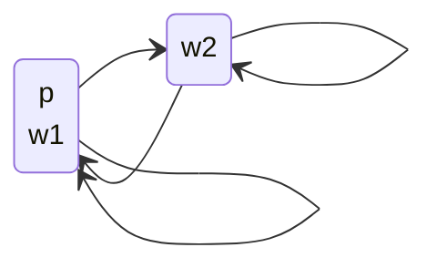
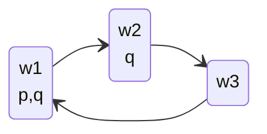

## Truth-Functionality
The connectives of **propositional logic** are truth-functional:

* This means that the truth of $\phi\wedge\psi$ is fully determined by the truth of $\phi$ and $\psi$.

If a proposition is not truth-functional we can describe it like so:

$$
\phi = 
\begin{cases}
p & \text{That happens to be true}\\
\top & \text{That is always true}
\end{cases}
$$

We are not sure whether $\phi$ will continue to be true.
{:.info}

## Language of Modal Logic
In modal logic we have an extra unary connective:

$$
\phi::=p\mid\neg\phi\mid\phi\wedge\phi\mid\square\phi
$$

$\lozenge\phi$ is an abbreviation for $\neg\square\neg\phi$.

### The Meaning of $\square$
$\square \phi$ has many meanings depending on the circumstance:

| Circumstance | Meaning |
| :-- | :-- |
| Alethic | $\phi$ is necessarily true |
| Epistemic | I know that $\phi$ is true |
| Doxastic | I believe that $\phi$ is true |
| Temporal | At every time in the future, $\phi$ will be true |
| Denotic | $\phi$ should be true |
| Legal | $\phi$ is legally required to be true |

### The Meaning of $\lozenge$
$\lozenge \phi$ has many meanings depending on the circumstance:

| Circumstance | Meaning |
| :-- | :-- |
| Alethic | $\phi$ is possibly true |
| Epistemic | As far as I know, $\phi$ might be true |
| Doxastic | I believe that $\phi$ might be true |
| Temporal | At some time in the future, $\phi$ will be true |
| Denotic | $\phi$ is allowed to be true |
| Legal | it is legal for $\phi$ to be true |

## Converting Language to Modal Logic
### Modal Logic to English Examples

* Temporal: $\square\lozenge p$:
	* At every point in the future, $p$ will be true some late time.
* Deontic: $\square p\implies\lozenge p$:
	* If $p$ is mandatory then it is also permitted.
* Legal: $\neg\lozenge\square\neg p$:
	* It is not permitted to forbid $p$.
* Epistemic: $\square p\implies\square\square p$:
	* If I know $p$, then I know that I know $p$.
	
### English to Modal Logic Examples

* "I know that Today is Thursday":
	* $p=\text{today is Thursday}$
	* $\square p$
* "If it it legal to walk here then is it legal to stand here":
	* $p=\text{walk here}$
	* $q=\text{stand here}$
	* $\lozenge p\implies\lozenge q$

There are also quotes which can be parsed multiple ways:

* "**I know that it is Monday** or it is Tuesday":
	* $\square p\vee q$
* "I know that **it is Monday or it is Tuesday**":
	* $\square (p\vee q)$
	
When translating an ambiguous sentence to logic, choose a disambiguation. All disambiguations will be acceptable in the exam.
{:.info}

## Possible Worlds
A possible world is a description of a possible state of the universe, or at least those parts of the universe that we care about.

### Possible Worlds Simple Example
Suppose we only care about whether it is currently raining in Liverpool. Then there are two possible worlds:

* $w_1$ it is raining
* $w_2$ it is not raining

We can relate this to a truth formula:

Let $p=\text{it is raining}$  
Then: $p$ is true on $w_1$, false on $w_2$

We can also draw this in a graph:

Say that we are in a box and we can't see the weather. If it is raining or not, we can't tell the difference. Therefore, you could be in either world:

* Arrows define possibility dependant on observation.

### Possible Worlds Formal Definition
A model $M$ is a triple $M=(W,R,V)$ where:

* $W$ is a set of possible worlds.
* $R\subseteq W\times W$ is a relation on $W$
	* $R$ is a set of pairs $(w_1,w_2)$ where $w_1$ and $w_2$ are in $W$.
* $V:\mathcal P\implies 2^W$ is a valuation
	* For ever $p\in\mathcal P$, $V(p)$ is the set of worlds where $p$ is true.

#### Drawing a Formal Definition

* $W=\{w_1,w_2,w_3\}$
* $R=\{(w_1,w_2), (w_2,w_3),(w_3,w_2),(w_3,w_1)\}$
* $V(p)=\{w_1\}$, $V(q)=\{w_1,w_2\}$

Worlds where $p$ and $q$ are not true are implicitly labeled with $\neg p$ and $\neg q$
{:.info} 