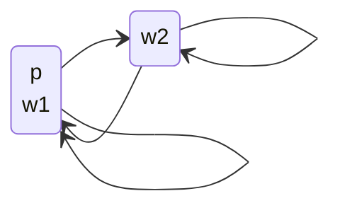
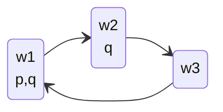
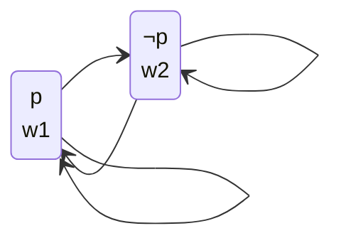
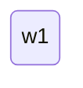
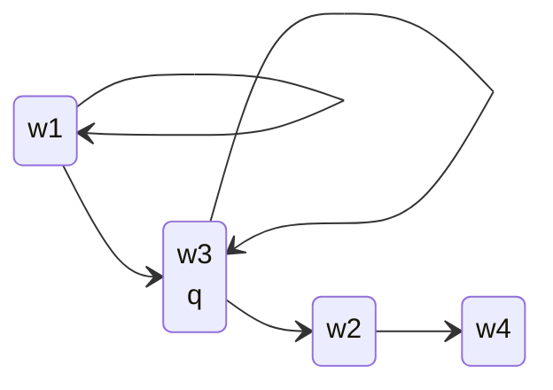
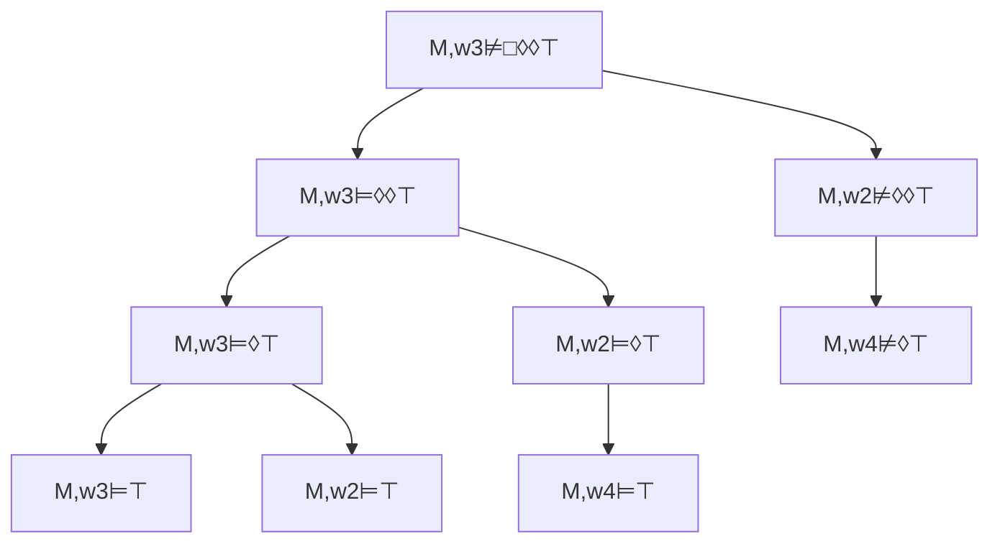

A possible world is a description of a possible state of the universe, or at least those parts of the universe that we care about.

## Possible Worlds Simple Example
Suppose we only care about whether it is currently raining in Liverpool. Then there are two possible worlds:

* $w_1$ it is raining
* $w_2$ it is not raining

We can relate this to a truth formula:

Let $p=\text{it is raining}$  
Then: $p$ is true on $w_1$, false on $w_2$

We can also draw this in a graph:

Say that we are in a box and we can't see the weather. If it is raining or not, we can't tell the difference. Therefore, you could be in either world:

* Arrows define possibility dependant on observation.

## Possible Worlds Model
A model $M$ is a triple $M=(W,R,V)$ where:

* $W$ is a set of possible worlds.
* $R\subseteq W\times W$ is a relation on $W$
	* $R$ is a set of pairs $(w_1,w_2)$ where $w_1$ and $w_2$ are in $W$.
* $V:\mathcal P\implies 2^W$ is a valuation
	* For ever $p\in\mathcal P$, $V(p)$ is the set of worlds where $p$ is true.

### Drawing a Model

* $W=\{w_1,w_2,w_3\}$
* $R=\{(w_1,w_2), (w_2,w_3),(w_3,w_2),(w_3,w_1)\}$
* $V(p)=\{w_1\}$, $V(q)=\{w_1,w_2\}$

Worlds where $p$ and $q$ are not true are implicitly labeled with $\neg p$ and $\neg q$
{:.info} 

## Semantics of Modal Logic
Modal logic is **evaluated** with respect to a **pointed model**:

* A pointed model is a pair $M,w$ where $w$ is a world view of $M$.

We can use the following notation:

* $M,w\vDash\phi$ if $\phi$ is true in $M,w$.

A modal logic formula $\phi$ is **valid** (denoted $\vDash\phi$) if $M,w\vDash\phi$ for every pointed model $M,w$.

### Determining Validity
If $M=(W,R,V)$ is a model and $w\in W$, then you determine whether $\phi$ holds in $M,w$ in the following way:

* $M,w\vDash p$ if and only if $w\in V(p)$
* $M,w\vDash\neg\phi$ if and only if $M,w\nvDash\phi$
* $M,w\vDash\phi_1\wedge\phi_2$ if and only if $M,w\vDash\phi_1$ and $M,w\vDash\phi_2$
* $M,w\vDash\square\phi$ if and only if, for every $w_2$ such that $(w,w_2)\in R$, we have $M,w_2\vDash\phi$

If $(w,w_2)\in R$ then $w_2$ is called a successor of $w$.

If there is an arrow from one world to another in a graph then the second is the successor of the first.
{:.info}

Therefore, $\square\phi$ holds in $w$ if and only if $\phi$ holds in every successor of $w$.

### Validity Example
Consider we have the following model:

We can define the model $M=(W,R,V)$ as:

* $W=\{w_1, w_2\}$
* $R=\{(w_1,w_1), (w_1,w_2),(w_2,w_1),(w_2,w_2)\}$
* $V(p)=\{w_1\}$

From this we can evaluate the following expressions:

* $M,w_1\vDash p$
	* True, as $w_1$ is in the set where $p$ is true.
* $M,w_2\vDash p$
	* False, as $p$ is not true in $w_2$.
* $M,w_1\vDash\square p$
	* False, as $w_2$ is a successor of $w_1$ and $p$ doesn't hold there.
	
### Semantics of $\lozenge$
$\lozenge$ is an abbreviation for $\neg\square\neg$. Therefore:

* $M,w\vDash\lozenge\phi$ if and only if $M,w\vDash\neg\square\neg\phi$

We can write this as:

> $M,w\vDash\lozenge\phi$ if and only if there is some successor $w_2$ of $w_1$ such that $M,w_2\vDash\phi$.

### Successor Trick Question
Consider the following model:

* $M,w_1\vDash\square p$
	* True, as **every** successor of $w_1$ satisfies $p$. Even if there are none of them
* $M,w_1\vDash\lozenge p$
	* False, as there is not **at least one** successor of $w_1$ that satisfies $p$.

### Possible World Semantic Example
Consider we have the following model:

$M,w_3\nvDash\square\lozenge\lozenge\top$ (does $\square\lozenge\lozenge\top$ hold in $w_3$)?

We can complete the following checks to verify this:

As $w_4$ has no successors $M,w_4\vDash\lozenge\top$ is false. This results in the original expression evaluating to false as not every successor is true.