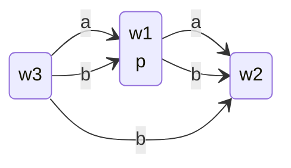

## Language of Multi-Agent Modal Logic
Currently we can say $\square\square\phi$ "I know that I know that $\phi$". If we want to say "I know that you know that $\phi$", with multiple agents, then we can annotate our boxes to define who knows what.

To define this, we can use the following:

* A set $\mathcal P=\{p,p_1,\ldots,p_n\}$ of propositional atoms.
* A set $\mathcal A=\{a,b,c,\ldots,a_n,b_n,c_n\}$ of agents

Therefore the language of multi-modal logic is:

$$
\phi::=p\mid\neg\phi\mid\phi\wedge\phi\mid\square_a\phi
$$

## Multi-Agent Models
These are very similar to single-agent models, however each relation has a label for which agents that relation is valid. We can define this as:

Multi-Agent Model: $M=(W,R,V)$ where:

* $W$ is a set of worlds
* $R=\{R_a\mid a\in\mathcal A\}$
* For every agent $a\in\mathcal A,R_a\subseteq W\times W$ is a relation
* $V$ is a valuation

### Example Multi-Agent Model
We can write a multi-agent model like so:

* $W=\{w_1,w_2,w_3\}$
* $R_a=\{(w_1,w_2),(w_3,w_1)\}$
* $R_b=\{(w_1,w_2),(w_3,w_1),(w_3,w_2)\}$
* $V(p)=\{w_1\}$

We should, specify relations for all agents, and the valuation for every atom. If we don't specify them, they are assumed to be empty.
{:.info}

We can merge the arrows and write the agents in a comma separated list.
{:.info}

## Semantics of Multi-Agent Modal Logic
If $M=(M,R,V)$ is a multi-agents model and $w\in R$, then you determine whether $\phi$ holds $M,w$ in the following way:

* $M,w\vDash p$ if and only if $w\in V(p)$
* $M,w\vDash\neg\phi$ if and only if $M,w\nvDash \phi$
* $M,w\vDash\phi_1\wedge\phi_2$ if and only if $M,w\vDash\phi_1$ and $M,w\vDash\phi_2$
* $M,w\vDash\square_a\phi$ if and only if, for every $w_2$ such that $(w,w_2)\in R_a$, we have $M,w_2\vDash\phi$
	
	The only difference here is that we verify $\square$ and $\lozenge$ only against relations defined by that agent.
	{:.info}

If $(w,w_2)\in R_a$ then $w_2$ is called an $a$-successor of $w$.

Therefore $\square_a\phi$ holds in $w$ if and only if $\phi$ holds in every $a$-successor of $w$.