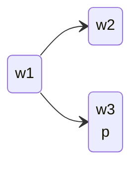

## Validity in Modal Logic
Like in propositional logic, some formulas are always true. These formulas are **valid**. We can write this as:

* $\vDash \phi$

Formally we write:

* $\vDash \phi$ if and only if $M,w\vDash \phi$ for every pointed model $M,w$.

### Modal Logic Validity Example
Consider the formula:

$$
\phi=(\square p\wedge\lozenge q)\implies\lozenge p
$$

To prove this is valid we will show that:

$$
M,w\vDash(\square p\wedge\lozenge q)\implies\lozenge p
$$

We know nothing about $M$ other than it is a model and $w$ is a world of that model. Therefore $M$ is a stand-in for **every** model.
{:.info}

We can prove this via **case distinction**:

1. If $M,w\nvDash\square p\wedge\lozenge q$, then $M,w\vDash(\square p\wedge\lozenge q)\implies q$.
1. If $M,w\vDash\square p\wedge\lozenge q$ then:
	1. $M,w\vDash\lozenge q$ so $w$ has some successor $w_2$ such that $M,w_2\vDash q$
	1. $M,w\vDash\square p$, and $w_2$ is a successor of $w$, so $M,w_2\vDash p$.
	1. So $w$ has at least one successor $w_2$ satisfying $p$.
	1. Therefore $M,w\vDash\lozenge p$.
	
Therefore it follows that $M,w\vDash(\square p\wedge\lozenge q)\implies\lozenge p$ and in either case it is true.

### Strategies for Proving Validity
So you want to prove whether $\phi$ is valid. Follow this process:

1. Make a guess.

	This doesn't have to be right.
	{:.info}
1. Act on your guess:
	* If you think that it is **valid**, take any pointed model $M,w$ and try to show that $M,w\vDash\phi$.
	* If you think that it is **not valid**, begin drawing a counterexample.

If you get stuck, then change your guess.
{:.info}

## Modal Logic Counterexamples
In modal logic, non-valid formulas have a counterexample. If $\nvDash\phi$, then a counterexample is a model $M,w$ such that $M,w\nvDash \phi$.

### Modal Logic Counterexample Example
Consider we have the formula:

$$
\lozenge p\implies\square p
$$

Counterexample:

Therefore we have:

$$
M,w_1 \nvDash\lozenge p\implies \square p
$$

## Satisfiability
A formula $\phi$ is satisfiable if there is **some** $M,w$ such that $M,w\vDash \phi$.

Therefore there is some pointed model in which $\phi$ is true.
{:.info}

### Satisfiability & Validity
There is a duality between satisfiability and validity.

* $\phi$ is valid if and only if $\neg\phi$ is not satisfiable.
* $\phi$ is satisfiable if and only if $\neg\phi$ is not valid.