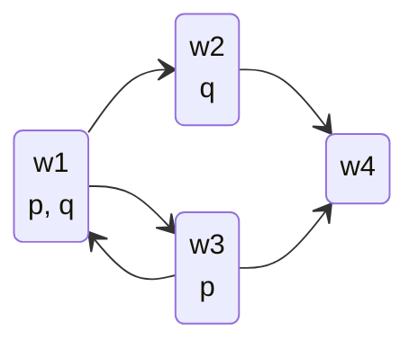

Formula games are formal games between two players:

* The "game board" is the formula.
* The Yes player tries to show that the formula is true.
* The No player tries to show that the formula is false.

There is always a winning strategy for one of the players.
{:.info}

## Formula Games for Propositional Logic
Games are defined as so:

* There is a **game state**: formula $\phi$ and a valuation.
	* So for every atom $p$, it is known whether $p$ is true.
* If $\phi=p$ then one player immediately wins:
	* If $p$ is true then Yes wins.
	* If $p$ is false then No wins.
* If $\phi=\neg\psi$, then the players switch places and continue to play with $\psi$.
* If $\phi=\psi_1\vee\psi_2$ then the Yes player chooses $\psi_1$ or $\psi_2$, the game continues with that formula.
	
	We want to try and choose the one which we can prove to be true.
	{:.info}
* If $\phi=\psi_1\wedge\psi_2$ then the No player choose $\psi_1$ or $\psi_2$, the game continues with that formula.
	
	We want to try and choose the one which we can prove to be false.
	{:.info}
* If $\phi=\psi_1\implies\psi_2$ then the Yes player chooses $\neg\psi_1$ or $\psi_2$, the game continues with this formula.
* If $\phi=\psi_1\iff\psi_2$, then the No player chooses $\psi_1\implies\psi_2$ or $\psi_2\implies\psi_1$, the game continues with that formula.

### Example Game 1

Formula: $p\iff (p\wedge q)$  
Valuation: $p$ is true, $q$ is false

1. P2 (No): chooses $p\implies(p\wedge q)$
1. P1 (Yes): chooses $\neg p$
1. Players switch places and game continues with $p$.
1. P2 (Yes): $p$ is true to Yes wins.

Player 2 started out as No, and both players played optimally. So $p\iff(p\wedge q)$ was false.
{:.info}

If either player chose the other option then their strategy would be suboptimal and you then can't use the outcome of the game to determine whether the formula is true.
{:.warning}

## Formula Game in Modal Logic
A formula game in modal logic is defined like so:

* Game state: a formula $\phi$ and pointed model $M,w$.
* If $\phi=p$, then Yes wins if $w\in V(p)$.
	* No wins if $w\notin V(p)$.
* If $\phi=\square\psi$ then No chooses a successor $w_2$ of $w$. The game continues with $\psi$ and $M,w_2$.
	* If no successor exists, Yes wins.
* If $phi=\lozenge\psi$ then Yes chooses a successor $w_2$ of $w$. The game continues with $\psi$ and $M,w_2$.
	* If no successor exists, No wins.
	
The rules from propositional logic also apply.
{:.warning}
	
### Example Game 2

Game Start: $w_1$  
Formula: $\lozenge\square(\square p\vee\lozenge r)$

1. P1 (Yes): chooses successor $w_2$. Game continues on $M,w_2$ with $\square(\square p\vee \lozenge r)$.
1. P2 (No): chooses successor $w_4$ (they have no choice). Game continues on $M,w_4$ with $\square p\vee\lozenge r$.
1. P1 (Yes): chooses $\square p$. Continues on $M,w_4$ with $\square p$.
1. P2 (No): can't choose a successor. Yes wins.

Both players played optimally, so Yes wins because $M,w_1\vDash\lozenge\square(\square p\vee\square r)$