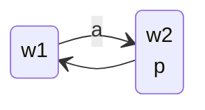

## The Meanings of $\square$

Consider the epistemic meaning of $\square$:

> I know that $\phi$ is true.

and also the following model:

From this graph we have:

* $M,w_1\vDash \square_ap$
* $M,w_1\nvDash p$

This is bad as agent $a$ knows something that is false.
{:.error}

We can consider this for all meanings:

| Circumstance | Example |
| :-- | :-- |
| Doxastic | I cannot believe $\phi$ and $\neg\phi$ at the same time, yet $\square_a\phi\wedge\square_a\neg\phi$ is satisfiable. |
| Alethic | If $\phi$ is necessarily true, then it is necessarily the case that $\phi$ is necessarily true. Yet $\square\phi\wedge\neg\square\square\phi$ is satisfiable. |
| Temporal | It is not possible for both $\phi$ and $\neg\phi$ to be true at all points in the future, yet $\square\phi\wedge\square\neg\phi$ is satisfiable. |
| Legal/Deontic | If $\phi$ is legally required, then $\phi$ is, ideally, legally permitted. Yet $\square\phi\wedge\neg\lozenge\phi$ is satisfiable. |

Due to the above contradictions, $\square$ doesn't capture all the properties of those circumstances. As a result we should make the following changes to our logic:

* Add **axioms** to the proof system.
* Restrict the **class of models** that are allowed.

### Additional Axioms

We can use the following **axioms** to solve this issue:

| Circumstance | Axiom |
| :-- | :-- |
| Epistemic | $\square_a\phi\implies\phi$ |
| Temporal | $\square\phi\implies\lozenge\phi$ |

There are additional axioms, and related model restrictions, that are required for **epistemic** logic.
{:.warning}

### Additional Models

We can give the following restrictions to our model to ensure that the above axioms are complete and sound:

| Axiom | Model |
| :-- | :-- |
| $\square_a\phi\implies\phi$ | The model should be **reflexive**, there is an arrow from every world to itself (for each agent). |
| $\square\phi\implies\lozenge\phi$ | The model should be **serial**, every world has a successor.

## Correspondence
The relation between the axioms and models above is called **correspondence**:

* $\square_a\phi\implies\phi$ corresponds to reflexivity.

We can define this as so:

An axiom $\psi$ (e.g. $\psi=\square\phi\implies\lozenge\phi$) corresponds to a property $\mathcal C$ (e.g. $\mathcal C=\text{seriality}$) if and only if:

* For every model $M$ that satisfies $\mathcal C$ and every world of that $w$ of that model, we have $M,w\vDash\psi$.
* For every model $M=(W,R,V)$ that does not satisfy $\mathcal C$ there are some alternative valuation $V'$ and some world $w\in W$ such that $(W,R,V')$, $w\nvDash\psi$.

### Importance of Correspondence
A proof system should be sound (everything that can be derived is valid) and complete (everything that is valid can be derived):

* If $\psi$ corresponds to property $\mathcal C$, then $\mathbf K+\psi$ is sound and complete with respect to the models that satisfy $\mathcal C$.
	
	There are some additional predicates that are required for this to be true that won't be discussed.
	{:.info}

This also works for multiple axioms and properties:

* $\mathbf K +\psi_1+\ldots+\psi_n$ is sound and complete with respect to the models that satisfy $\mathcal C_1,\ldots,\mathcal C_n$