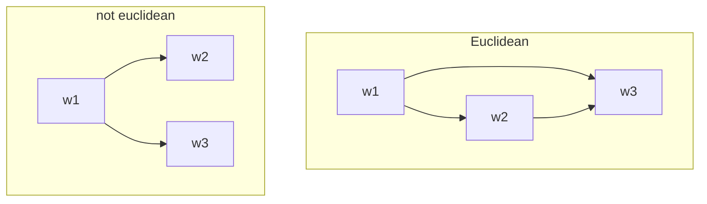
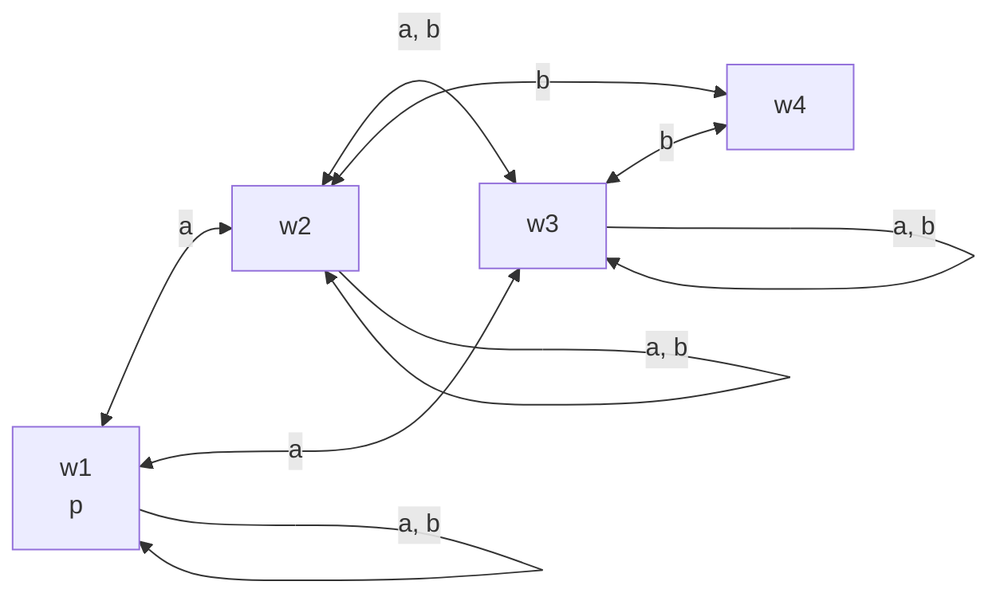
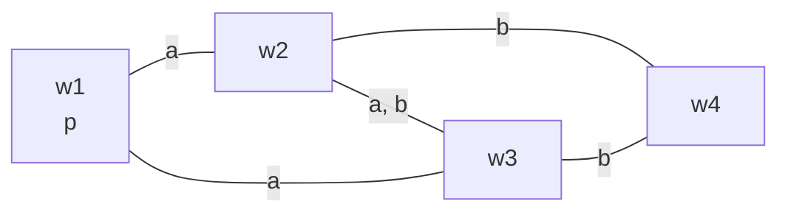

The correspondence of:

* Reflexivity and truthfulness
* Transitivity and positive introspection
* Euclidity and negative introspection

This proof system is known as $S5$.

## Truthfulness
Knowledge is truthful, therefore:

$$
\square\phi\implies\phi
$$

This axiom corresponds to **reflexivity**. This means that there is an arrow from each world to itself (for each agent).

## Positive Introspection
Generally assumed of knowledge: everyone knows which things they know. Therefore:

$$
\square_a\phi\implies\square_a\square_a\phi
$$

This axiom corresponds to **transitivity**. A multi-agent model $M=(W,\mathbf R, V)$ is transitive if for every agent $a$ and every three worlds $w_1,w_2,w_3\in W$: if $(w_1,w_2)\in R_a$ and $(w_2,w_3)\in R_a$ then $(w_1,w_3)\in R_a$.

This means that a model is transitive if there are always shortcuts in a chain of three worlds.
{:.info}

## Negative Introspection
If and agent $a$ doesn't know $\phi$, then $a$ knows that they don't know $\phi$. Therefore:

$$
\neg\square_\phi\implies\square_a\neg\square_a\phi
$$

This corresponds to **euclidity**. A multi-agent model $M=(W,\mathbf R, V)$ is euclidean if for every agent $a$ and every three worlds $w_1, w_2, w_3\in W$: if $(w_1, w_2)\in R_a$ and $(w_1,w_3)\in R_a$ we then $(w_2,w_3)\in R_a$.

A minimum example of this would look like so:

## $S5$
The proof system $S5$ has the following axioms:

* $T$ - All (substitution instances of) validities of propositional logic.
* $K$ - $K_a(\phi\implies\psi)\implies(K_a\phi\implies K_a\psi)$
* $M$ - $K_a\phi\implies\phi$
* $4$ - $K_a\phi\implies K_aK_a\phi$
* $5$ - $\neg K_a\phi\implies K_a\neg K_a\phi$

and the following two rules:

* MP - If you have derived $\phi$ as well as $\phi\implies\psi$, derive $\psi$.
* Necc - If you have derived $\phi$, derive $K_a\phi$.

In epistemic logic we can write $\square$ as $K$ and $\lozenge$ as $M$ to denote we are reasoning about knowledge.
{:.info}

If $\phi$ is derivable in $S5$, we write $\vdash_{s5}\phi$.

## Models of Epistemic Logic
We also make the following model restrictions:

A model of epsitemic logic is a triple $M=(W,\mathbf M,V)$ where:

* $W$ is a set of world.
* $\mathbf R=\{R_a\mid a\in\mathcal A\}$
* For every agent $a$, the relation $R_a\subseteq W\times W$ is reflexive, transitive and euclidean.
* $V:\mathcal P\implies 2^W$ is a valuation.

### Symmetry
To simplify models of epistemic logic we can make the following assumption:

* A model is reflexive, transitive and euclidean if and only if it is:

	* Reflexive
	* Transitive
	* Symmetric

Symmetric models only use arrows with heads at both ends.
{:.info}

### Example Model of Epistemic Logic
In order to simplify drawing a model of epistemic logic we take shortcuts. The following model:

can be drawn like so in epistemic logic:

We don't draw:

* Transitive loops.
* Arrowheads, as all are double-ended.
