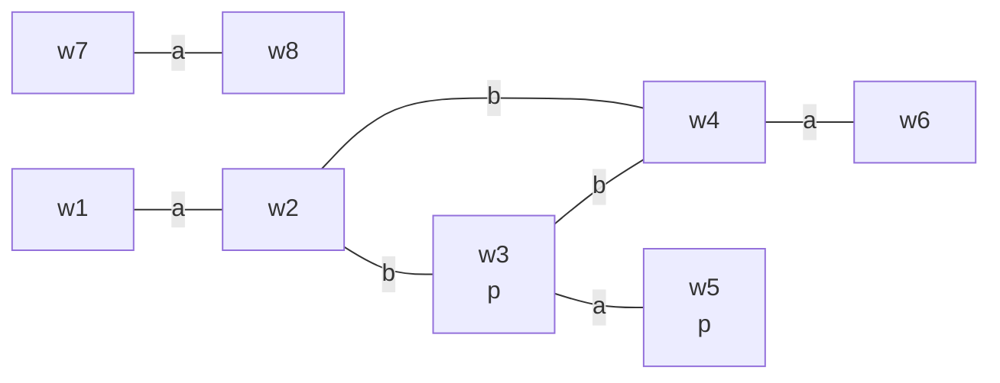

Common knowledge relates to multiple agents knowing the same thing about each-other:

* People drive on the left because we know that other people know to drive on the left.

## Definition of Common Knowledge
We can use $E$ to denote that "everybody knows":

* $E\phi$ means $K_a\phi\wedge K_b\phi\wedge\ldots$

### Fixed Point Definition
A formula $\phi$ is common knowledge, denoted by $C\phi$, if and only  if:

* Everybody knows $\phi$ (so $E\phi$)
* Everybody knows that $\phi$ is common knowledge (so $EC\phi$).

This definition is circular, so can't be proven.
{:.info}

### Transitive Closure Definition
A formula $\phi$ is common knowledge, denoted by $C\phi$, if and only  if:

* Everybody knows $\phi$ (so $E\phi$)
* Everybody knows that everybody knows $\phi$ (so $EE\phi$)
* Everybody knows that everybody knows that everybody knows $\phi$ (so $EEE\phi$)
* $\vdots$

This one is linear to can be determined.
{:.info}

## Semantics of "Everybody Knows"

* $M,w\vDash E\phi$ if and only if every successor of $w$ satisfies $\phi$ (regardless of which agent defines the successor)
* Additionally:
	
	$$
	M,w\vDash E\phi\iff M,w\vDash K_a\phi\wedge K_b\phi\wedge\ldots
	$$

## Semantics of Common Knowledge

* A world $w_2$ is reachable from $w_1$ if $w_2$ is a successor of a successor of $\ldots$ a successor of $w_1$.
* $M,w_1\vDash C\phi$ if $\phi$ holds on every world that is reachable from $w_1$.

* $M,w_1\nvDash C\neg p$, since $w_3$ and $w_5$ satisfy $p$ and are reachable from $w_1$.
* $M,w_1\vDash C(p\implies K_ap)$, since every reachable world satisfies $p\implies K_ap$.
* $M,w_7\vDash C\neg p$, since every world reachable from $w_7$ (namely $w_7$ and $w_8$) satisfy $\neg p$.

## Public Announcements
You can never gain common knowledge by using imperfect communication channels.

A public announcement is an event that provides new information to the agents in such a way that:

* All the agents receive the same information.
* The received information is true.
* It is clear to all the agents that everyone receives the information without error.
	
	Other agents should observe other agents observing.
	{:.info}

Notation: $[\phi]\psi$ meaning "after $\phi$ has been publicly announced, $\psi$ is true."

### Semantics of Public Announcements

* The public announcement operator $[\phi]$ is a **dynamic operator**:
	* This means that to determine whether $M,w\vDash[\phi]\psi$ we have to look at a different model $M*\phi$

1. This model $M*\phi$ is obtained by removing all $\neg\phi$ worlds from $M$.
1. All arrows to and from removed worlds are simply deleted.

A public announcement has to be true. If $\phi$ is false we consider $[\phi]\psi$ to be trivially true.
{:.info}

We **define** public announcements like so:

Let $M=(W,\mathbf R, V)$ be a model and let $w\in W$. Then $M,w\vDash[\phi]\psi$ if and only if either $M,w\nvDash\phi$ or $M*\phi,w\vDash\phi$ where:

$$
\begin{aligned}
M*\phi&=(W*\phi,\mathbf R*\phi,V*\phi)\\
\mathbf R*\phi&=\{R_a*\phi,R_b*\phi,\ldots\}\\
W*\phi&=\{w_1\in W\mid M,w_1\vDash\phi\}\\
R_a\phi&=R_a\cap(W*\phi\times W*\phi)\\
V*\phi(p)&=V(p)\cap W*\phi
\end{aligned}
$$

There are many examples of public announcment models starting [at slide 12](https://canvas.liverpool.ac.uk/files/8285812/download?download_frd=1)
{:.info}