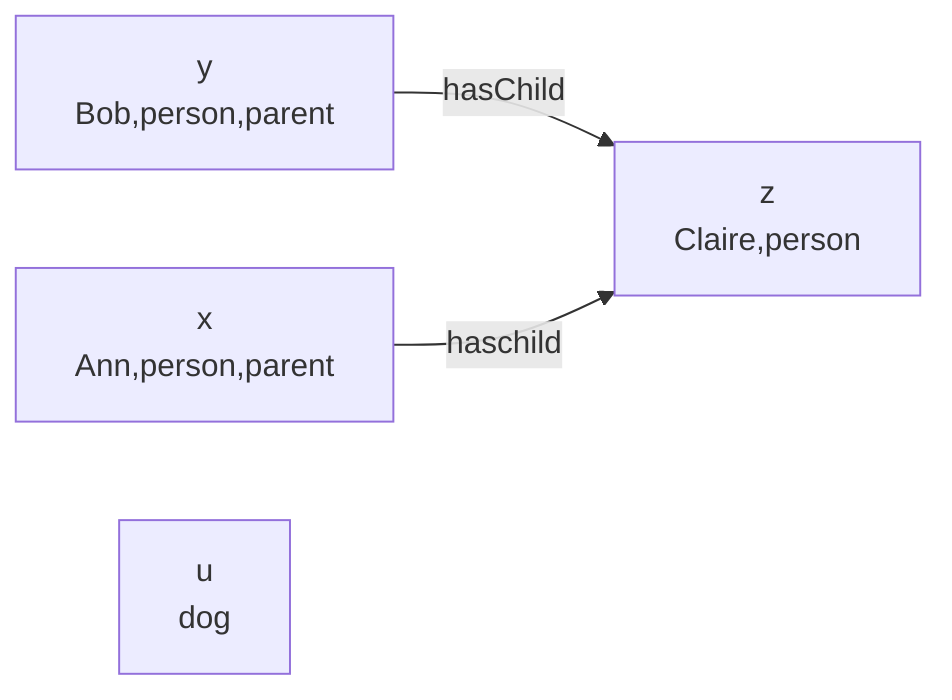

Description logic is used to describe ontologies:

> An ontology defines objects by their relations to other objects.

We have seen ontologies before in COMP111:

* [Derived Assertions Algorithm]({{site.baseurl}}/comp111/lectures/2020/11/05/3.html)
* [Relations & Non-Unary Rule-Based Systems]({{site.baseurl}}/comp111/lectures/2020/11/05/4.html)

## Language of ALC
Attribute logic with complement (ALC) is a multi-agent modal logic (with different symbols).

An ALC signature is a triple $\Sigma=(\mathcal O, \mathcal C, \mathcal R)$ where:

* $\mathcal O$ is a set of object names.
* $\mathcal C$ is a set of atomic concepts.
* $\mathcal R$ is a set of relations symbols.

This is comparable to the set of propositional atoms and the set of agents that were used in propositional and modal logic.
{:.info}

Formulas of ALC are called **concepts**. Concepts are denoted by $X,Y,Z,X_1,\ldots$ and given by:

$$
X::=\top\mid\bot\mid A\mid\neg X\mid X\sqcup X|X\sqcap X| \forall r.X\mid\exists r.X
$$

where $A\in\mathcal C$ and $r\in\mathcal R$.

* An **object name** $o\in O$ describes a single object. There can be objects without names, but every name refers to exactly one object. No object has multiple names.
	* Ann, Bob; Fido.
* An **atomic concept** is a single word that describes a number of objects.
	* Parent, father, male, person; dog.
* A **concept** combines one or more atomic concepts into a more complex description:
	* A parent who is male.
	* A person who has a t least one child that is a parent.

The final two concepts are defined as:

* $\exists r,X$ indicates those objects that stand in the relation $r$ to some object that is $X$:
	* $\exists\text{hasChild}.\text{female}$ is someone who has at least one daughter.
* $\forall r.X$ indicates those objects taht only stand in the relation $r$ to objects that are $X$:
	* $\forall\text{hasChild}.\neg\text{female}$ is someone who only has children that are not $\text{female}$ (a person whose children, if any, are all sons).
	
Additionally:

* $\top$ defines **any** object.
* $\bot$ indicates **no** objects.

### ALC Language Examples

* A person who has at least one child:
	* $\text{person}\sqcap\exists\text{hasChild}.\top$
* A parent who is male:
	* $\text{parent}\sqcap\text{male}$
* A person who has at least one child that is a parent:
	* $\text{person}\sqcap\exists\text{hasChild}.\text{parent}$

## Semantics of ALC
### ALC Interpretations
In description logic we refer to models as **interpretations**.

Let $\Sigma=(\mathcal O,\mathcal C,\mathcal R)$ be a signatire. An interpretation $\mathcal I$ over $\Sigma$ is a pair $(\Delta,\cdot^\mathcal I)$ where:

* $\Delta$ is a domain (a non-empty set).
* $\cdot^\mathcal I$ maps $\mathcal O$ to $\Delta$:
	* For every $o\in \mathcal O$, $o^\mathcal I\in\Delta$.
* $\cdot^\mathcal I$ maps $\mathcal C$ to $2^\Delta$:
	* For every $C\in \mathcal C$, $C^\mathcal I\subseteq\Delta$.
* $\cdot^\mathcal I$ maps $\mathcal R$ to $2^{\Delta\times\Delta}$:
	* For every $r\in \mathcal R$, $r^\mathcal I\subseteq\Delta\times\Delta$.
	
and further more $o^\mathcal I_1\neq o^\mathcal I_2$ unless $o_1=o_2$

#### What are Interpretations

* $\mathcal O$ are a set of names of individuals, $\mathcal C$ a set of names of concepts and $\mathcal R$ a set of names of relations.
* $\Delta$ are things that actually exist.
* The map $\cdot^\mathcal I$ tells us who has which name:
	* $\text{Ann}^\mathcal I$ is the person who has the name Ann.
	
### Drawing Interpretations
Suppose:

* $\mathcal O=\{\text{Ann, Bob, Claire}\}$, $\mathcal C=\{\text{person, dog, parent, grandparent}\}$, $\mathcal R=\{\text{hasChild}\}$
* $\Delta=\{u,x,y,z\}$
* $\text{Ann}^\mathcal I=x$, $\text{Bob}^\mathcal I=y$, $\text{Claire}^\mathcal I=z$
* $\text{person}^\mathcal I=\{x,y,z\}$, $\text{dog}^\mathcal I=\{u\}$, $\text{parent}^\mathcal I=\{x,y\}$, $\text{grandparent}^\mathcal I=\emptyset$
* $\text{hasChild}^\mathcal I=\{(x,z),(y,z)\}$

This can be drawn as:

