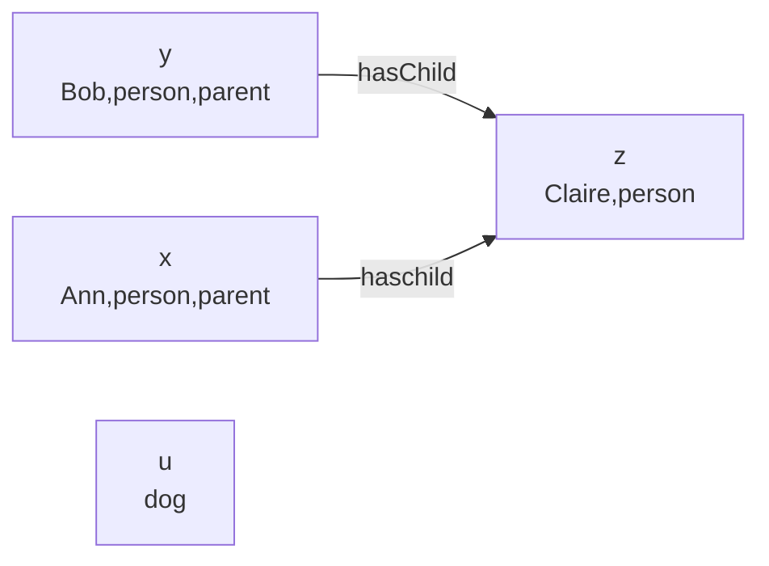

## Subsumption
In description logic we want to compare concepts to each other. Comparisons are called **subsumptions**.

Subsumptions are of the form:

* $X\sqsubseteq Y$

	The objects that satisfy $X$ are a subset of the objects that satisfy $Y$.
	{:.info}
* $X\equiv Y$

	The objects that satisfy $X$ are exactly the same as the objects that satisfy $Y$.
	{:.info}
	
## TBox
Taxonomy
: A categorisation of concepts.

TBox
: A finite set of subsumptions that represent a taxonomy.

TBox may only contain subsumptions where the left-hand side is an atomic concept (not a complex concept).
{:.warning}

### Example TBox

* $\text{parent}\equiv\text{person}\sqcap\exists\text{hasChild}.\top$
* $\text{father}\equiv\text{parent}\sqcap\text{male}$
* $\text{mother}\equiv\text{parent}\sqcap\text{female}$
* $\text{grandparent}\equiv\text{person}\sqcap\exists\text{hasChild}.\text{parent}$

## ABox
Sometimes we want to make more specific statements such as "Ann is a parent". We do this using **concept** and **role assertions**.

Concept Assertion
: The object with the name $o$ satisfies the concept $X$.

$$
o:X
$$

We can write:

* $\text{Ann}:\text{Parent}$

Role Assertions
: The objects with names $o_1$ and $o_2$ stand in relation $r$ to eachother.

$$
(o_1,o_2):r
$$

We can write:

* $(\text{Ann},\text{Claire}):\text{hasChild}$
	
	This means Ann has a child called Claire.
	{:.info}

Therefore an ABox is a finite set of concepts and role assertions.

A **knowledge base** $\mathcal K$ is a set of A and T boxes:

$$
\mathcal K=(\mathcal A,\mathcal T)
$$

## Satisfaction
### Assertion Satisfaction
Let $\mathcal I=(\Delta,\cdot^\mathcal I)$ be an interpretation, and let $\mathcal A$ be an ABox:

* $\mathcal I\vDash o:X\text{ iff } o^\mathcal I\in X^\mathcal I$
* $\mathcal I\vDash (o_1,o_2):r\text{ iff }(o_1^\mathcal I,o_2^\mathcal I)\in r^\mathcal I$
* $\mathcal I\vDash\mathcal A\text{ iff } \mathcal I$ satisfies all assertions in $\mathcal A$

### Subsumption Satisfaction
Let $\mathcal I=(\Delta,\cdot^\mathcal I)$ be an interpretation and let $\mathcal T$ be a TBox:

* $\mathcal I\vDash X\sqsubseteq Y\text{ iff } X^\mathcal I\subseteq Y^\mathcal I$
* $\mathcal I\vDash X\equiv Y\text{ iff }X^\mathcal I=Y^\mathcal I$
* $\mathcal I\vDash \mathcal T \text{ iff }\mathcal I$ satisfies all subsumptions in $\mathcal T$

### Knowledge Base Satisfaction
Let $\mathcal I$ be an interpretation and $\mathcal K=(\mathcal A,\mathcal T)$ be a knowledge base:

* $\mathcal I\vDash\mathcal K\text{ iff }\mathcal I\vDash\mathcal A$ and $\mathcal I\vDash\mathcal T$

### Satisfaction Example
Consider the interpretation from the previous lecture:

* $\mathcal I\vDash \text{Ann}:\exists\text{hasChild}.\text{person}$
* $\mathcal I\nvDash\text{dog}\equiv\neg\text{parent}$
	
	This is because there are people who are not parents.