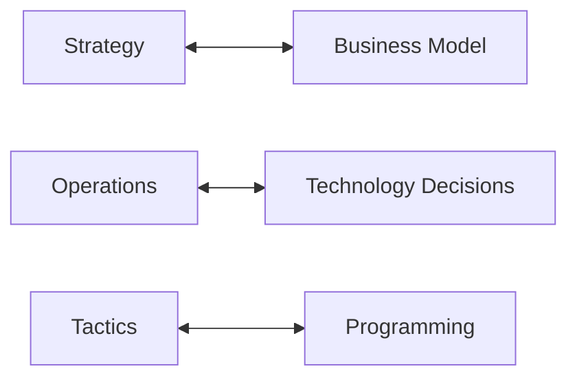

## Value Proposition

What do you deliver that is *perceived* to be of value to your customers?

You may choose something that provides no value in order to scam people.
{:.warning}

Revenue Model
: Who will pay you?

Market Situation
: Who are your competitors? What advantage to you have over them? How big is the market for your product? How will you attract your audience?

Organisation
: Who will work for your company and how will they be organised?

There are two considerations to be aware in an e-commerce value proposition:

* Does your value lie in the service you offer, or in how you offer it?
* What does being e-commerce add?

### Revenue Model
There are several types of revenue model:

| Type | Description |
| :-- | :-- |
| Sales Model | You get money for selling stuff. |
| Transaction Fee Model | You get paid for selling other people's stuff. |
| Subscription Model | Customers pay a fixed fee for your service. |
| Freemium Model | Basic service is provided for free. Higher tiers use other service models. |
| Advertising Model | Sell advertisements that are shown to your customers. |
| Data Broker Model | You sell access to information about your customers - dangerous. |
| Affiliate Model | You get paid for sending customers to someone else. |
| Donation Model | Get paid by voluntary donations from customers - risky. |

Some services use a combination, or other, models such as:

* The Guardian:
	* Uses advertising and donation online.
	* Uses a subscription model for print.
	
### Market Situation
* How big is the market you are trying to capture?
* What competition do you have?

	Includes both direct competition for the same service, and indirect for substitutes. Uber has direct competition from Lyft, indirect from black cabs and public transport.
	{:.info}
* What advantages/disadvantages do you have compared to the competition?
* Will you have issues with regulation?

### Organisation

* What is your company attitude?
* What is your approach to recruitment?

### Uber Case Study 

1. What value does Uber offer?
		
	Immediate rides through your phone.
1. Where does Uber derive its revenue from?
	
	* Subscription with Uber one.
	* Transactional fee to setup a driver and customer.
1. What competition does Uber face?

	* Black cabs.
	* Conventional taxis.
	* Public transport.
	* Personal transport.
1. How does Uber’s company structure work?
	
	The drivers are not employees.
1. Does Uber face any regulatory threats?

	Treatment of workforce. Employees or contractors?
1. Have the answer to any of these questions changed over time?

	Yes, subscription is added. Competition has increased in addition to regulation.
	
### YouTuber Case Study

1. What value do YouTubers offer?
1. Where do YouTubers derive their revenue from?
1. What competition do YouTubers face?
1. How do YouTubers' company structures work?
1. Do YouTubers face any regulatory threats?
1. Have the answer to any of these questions changed over time?

## Strategy, Operations & Tactics

These are in the following hierarchy:

* Strategy
	* Operations
		* Tactics

They apply to the following analogy:

This is to say that technology and programming both serve the business model.