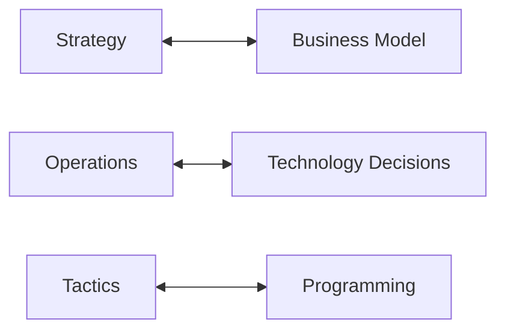
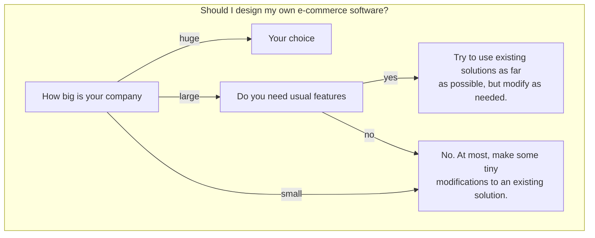

## Strategy, Operations & Tactics

These are in the following hierarchy:

* Strategy
	* Operations
		* Tactics

They apply to the following analogy:

This is to say that technology and programming both serve the business model.

## Build, Buy or Rent
When deciding whether to make any technology for e-commerce consider the following flowchart:

Designing your own e-commerce is generally a bad idea.
{:.error}

### Available Options for Buy & Rent

* You could sell on an existing platform, like Amazon.
	* Reliable and convenient, but the platform will take a fee.
* You could purchase or rent a licence to an existing package. 
	* More flexible than using an existing platform, but can be costly.
* You could use (and possibly adapt) an open source platform.
	* Great flexibility, but requires more work and expertise than other options.