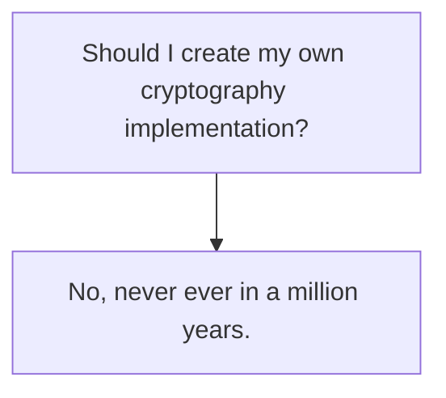

## Zero Knowledge Proofs
This type of cryptography allows a person to prove that they can do, or know, something without revealing the method or secret.

They typically follow a challenge response system:

* If you know secrets $s$, you will be able to solve problem $x$.

Cryptographic signing functions can be used with the challenge being the message to sign.
{:.info}

## Attacks
Direct attacks on cryptographic algorithms are pretty much pointless. Hence, indirect attacks are usually more effective.

### Implementation Weaknesses

* Nonces are reused.
* Random number generator is predictable.
* Implementation contains a bug.

### Side-Channel Attacks
We can use data leaked into other channels to attack a system:

* Time or Power used.
* Keyboard sounds.
* Caching/Access Violations

### Social Engineering & Rubber Hose
We can also manipulate people to give us the keys:

* Social engineering.
* Key-loggers
* Use of threats or violence.

## Implementing Encryption
Use the following flowchart in an e-commerce situation:

