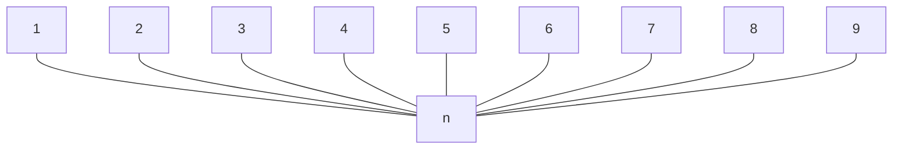

## Network Topology
### Direct Connection
The simplest network is a direct connection between two peers that wish to communicate.

This doesn't scale well and is costly. For $x$ nodes there will be:

$$
\frac{x(x-1)}{2}
$$

connections.

They are useful if you require:

* Extreme Speed
* Extreme Secrecy
* Extreme Bandwidth

### Star Topology

All nodes connect to a central hub that distributes communications. This scales better but can be easily overwhelmed due to the single point of failure.

### Tree
This is a collection of sub-networks that are joined by a central hub. This helps for communicating between neighbours quicker.

### Mesh
This is a messy topology that has a number of connections between leaves. Generally the number of connections **required** is:

$$
x-1
$$

For a more **stable** network, the following number of connections is suggested:

$$
x\log(x)
$$

### Internet Topology
There are a number of tiers with progressively reduced nodes. There are links between nodes in the same tiers and their children.

This is bad from a security standpoint as your message may have to travel through several third parties.
{:.warning}

## Layers
Refer to:

* [Protocol Layers & Reference Models]({{site.baseurl}}/comp211/lectures/2021/10/01/2.html) - `COMP211`

for the protocol layer structure.

## Metadata
### HTTPS Metadata
For HTTPS over TCP over IP, the following is leaked:

* IP Addresses and ports of the sender & receiver.
* Target domain name.
* Size and time of the transfer.
* Information about the type of encryption used and certificates.

### Email Metadata
Only the body of an encrypted, with PGP, from the email server. In flight the email is encrypted using TLS. Thus, the following are leaked:

* Message time and size.
* Sender
* Receiver
* Subject

Sender and receiver could be hidden by using a service such as TOR.
{:.info}

## Metadata Mitigation

> We kill people based on metadata. - Michael Hayden (CIA, NSA Former Director)