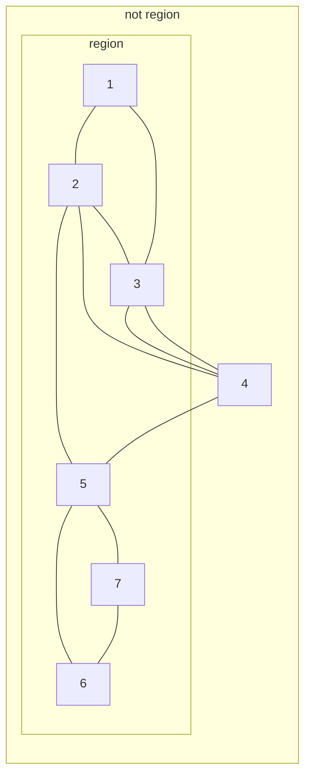
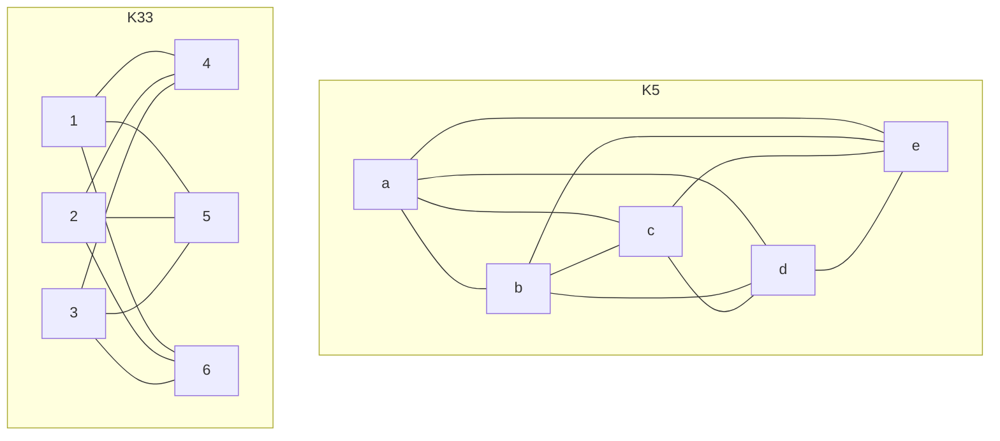

This [networks page from Barabási](https://barabasi.com/book/network-science) will be a useful external resource for the course.

## Existing Definitions 

> A network is a structure formed by a collection of nodes (vertices) connected by links (edges).

Path
: A sequence of distinct nodes, such that nay two successive elements are joined by a link.
	
The **length** of a finite path is the number of **links** in it.
{:.info}

Cycle
: A finite path $x_1, x_2, \ldots, x_n$ such that $x_1=x_n$.

Distance
: The length of the shortest path between two nodes.

## Acyclic Networks
Networks **without cycles** are called acyclic:

* Trees are an example of acyclic networks.

## Bipartite Networks
A network is bipartite if its nodes can be subdivided in two groups with **no link** joining two nodes in the same group.

## Planar Networks
A network is planar if it can be drawn in the plane without lines crossing.

A **region** in a planar network is an area surrounded by links which do not contain smaller regions. For the following graph:

The **girth** of a network is the length of the smallest cycle in the network.

For the network above, its girth is 3.
{:.info}

### Euler Magic Formula
Every connected planar network with $n$ nodes, $m$ links and $r$ regions satisfies:

$$
n - m + r = 2
$$

## Maximal Networks
Assume that $G$ is a connected planar network with $n$ nodes and $m$ links, and all of its regions have at least $g$ sides. Each link belongs to two regions only.

Hence if $F$ is the collection of all regions:

$$
\sum_F\left\vert f\right\vert=2m
$$

Where:

* $\left\vert f\right\vert$ is the size of $f$.

As we know that the size of $f\geq g$:

$$
gr\geq 2m
$$

In this we can substitute the **Euler formula**:

$$
\begin{aligned}
g(2-n+m)&\leq2m\\
m&\leq\frac g{g-2}(n-2)\\
m&\leq\frac{gn-2n}{g-2}
\end{aligned}
$$

## Non-planar Networks
Consider the following two networks:

Where:

* $K_{3,3}$ is a fully connected bipartite graph with 3 nodes on each side.
* $K_5$ is a fully connected graph with 5 nodes.

**Kuratowski's Principle** states:

> Any network that is non-planar must contain $K_5$ or $K_{3,3}$ or a network obtained from one of these by replacing a link with a simple path.

Therefore we can identify these shapes in networks to avoid having to use Euler's formula.