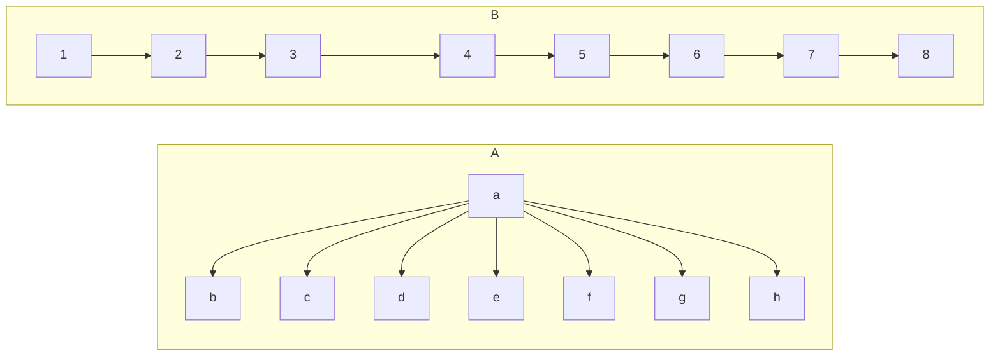
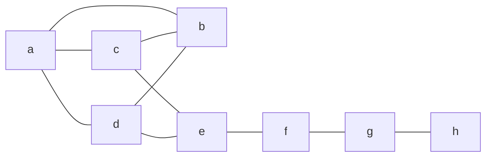

## Degrees in a Network
The degree of a node $v$ in a network $G$ is the number of links attaches to that node.

This is denoted by:

$$
\deg_Gv
$$

We can omit the subscript $G$ when the graph is clear from the context.
{:.info}

In general the sum of degrees of the nodes of a network equals twice the number of links $m$ in that network:

$$
\sum_v\deg v=2m
$$

### Average Degree
The average degree of a network $G$ is calculated as expected:

$$
\bar d_G=\frac{\sum_v\deg_Gv}n
$$

The average degree depends only on the number of links and nodes in the network:

$$
\bar d_G=\frac{2m}n
$$

The following networks have the same average degree:

## Network Density
The density of a network is a number between zero and one.

The density of a network $G$ is the quantity:

$$
\bar e=\frac m{\frac n2}
$$

A *normalised* average degree is:

$$
\bar e =\frac{\bar d_g}{n-1}
$$

### Sparse & Dense Networks
Informally we say:

* A network is **sparse** if it contains a number of links not much larger than its number of nodes.
* A network is **dense** if it contains a number of links close to the square of its nodes.

Given we have a network with **many nodes**:

A network $G$ on $n$ nodes is $c$-**sparse** if there exists a positive constant $c$ **smaller than**:

$$
\frac{n-1}4
$$

such that $G$ has at most $cn$ links.

A network is $c$-**dense** if there exists a positive $c$ such that $G$ has at least $c\times {n\choose 2}$.

This is $n$ choose 2.
{:.info}

### Directed Graph Degree
For directed graphs you can also consider:

* In-degree
* Out-degree

### Connected Networks
A network is connected if either of the following are true:

* Every pair of nodes are connected by a path.
* You can walk along the links from any node to any other node.

If both of these are false then:

The network is **split** into a number of **connected components**.

## Diameter
The diameter of a network is the longest distance between two nodes of the network. The diameter of the following network is **five**:

## Random Walks
Random walks provide an alternative to BFS and DFS. The expected exploration is:

$$
O(n^3)
$$

It can be proved that, in the long run, the sample tends to favour nodes with many links. The frequency of a node in the walk of degree $d$ tends towards:

$$
\frac d{2m}
$$

The methods is as follows:

1. Enumerate the neighbours of a node and sort them in ascending order.
1. Generate a random number.
1. Scale the random number to choose a random node from the set of neighbours.

### Metropolis Random Walk
A metropolis random walk is a variation of a random walk. It has the following method:

1. Select a random candidate neighbour.
1. Compute the chance of moving by calculating $\frac{\deg n}{\deg m}$.
	* Where $n$ is the current node and $m$ is the candidate neighbour.
1. If the probability is $\geq 1$ move to the candidate neighbour.
	* Else compare the probability to another random number.
		* If the probability is greater than the new random number, move to the candidate neighbour.
		* Else try again with a new candidate.