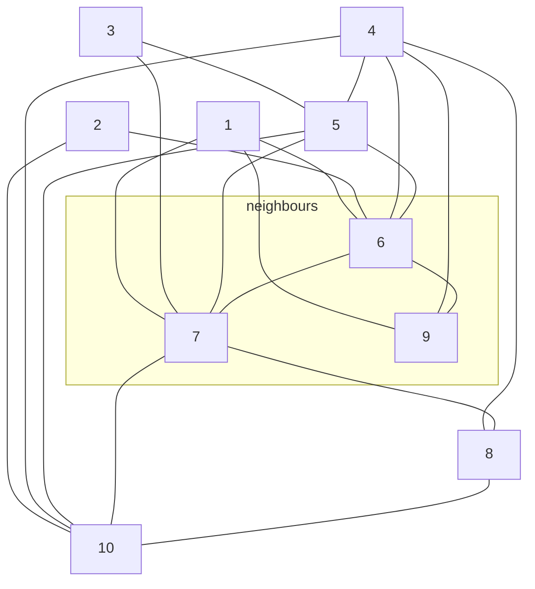

One task with a network is to find which nodes are important. We can do this in several ways.

## Degree Centrality
The simplest way to measure the importance of a node $v$ is to measure its **degree** $\deg v$.

Nodes with higher degree are more important. An example would be author's citing papers:

* Generally the more people cite a paper, the more important the paper is.

We can also look at the example of friendship:

* A high **in-degree** denotes a very popular person.
* A high **out-degree** donates a very outgoing person.

This method is prone to spamming, like with initial versions of Google's PageRank.
{:.warning}

## Local Clustering
Instead of looking for highly connected nodes we can look for nodes that **control the flow of information** around them. Consider the following measure:

$$
\text{lc}_v=\frac{e(N(v))}{\deg v\choose 2}
$$

Note that $\deg v \choose 2$ is $\deg v$ choose $2$.
{:.info}

where:

* $\text{lc}_v$ - is the **local clustering coefficient** of the node $v$.
* $N(v)$ - the set of neighbours of the node $v$.
* $e(N(v))$ - the number of connections between pairs of elements in $N(v)$.

The definition can be extended to the case of nodes of degree less than two by setting $\text{lc}_v=0$.
{:.info}

It is defined as the ratio between the **number of pairs of neighbours** of $v$ that are connected and the **total possible number** of such connections.

For this to work we assume that there are no loops or parallel links between nodes.
{:.warning}

### Local Clustering Example
Given the following graph:

To calculate $\text{lc}_1$ we look at the neighbours of 1 which are $\{9, 6, 7\}$:

* There are three neighbours $\deg v=3$.
* There are two internal connections between neighbours $e(N(v))=2$.

therefore:

$$
\text{lc}_1=\frac23
$$

### Control

* If $\text{lc}_v$ is **low** we say $v$ *can controls* its neighbourhood.
	
	This means that communication between neighbours will tend to go through the node $v$.
	{:.info}

### Global Clustering
You can calculate the clustering property of a whole network using the following measure:

$$
\text{lc}=\frac1n\sum_v\text{lc}_v
$$

## Closeness Centrality
A vertex might be considered important if it's got a small mean distance to any other vertex in the network.

The closeness centrality of a node $v$ is defined in a network $G$ having a node set $V$ and link set $E$ in terms of the following quantity:

$$
\ell_v=\frac1n\sum_{u\in V}\text{dist}(v,u)
$$

where:

* $\text{dist}(u,v)$ - is the length of a shortest path between $v$ and $u$.

This measures the average distance from $v$ as a global property.
{:.info}

For nodes within the same graph the values of $\ell_v$ are very close to each-other. You can **scale** the output by excluding the distance of a vertex from itself from the average:

$$
\ell'_v=\frac1{n-1}\sum_{u\in V}\text{dist}(v,u)
$$

From this we can calculate the closeness centrality:

$$
C_v\frac1{\ell_v}
$$

If two nodes $u$ and $v$ are not connected (as they lay in different components) then:

$$
\frac1{\text{dist}(v,u)}=0
$$