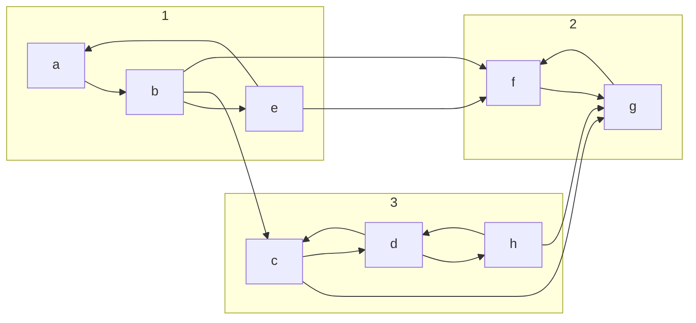

## Components in Undirected Networks
Most networks are formed by a single **giant** (a component connecting most of the nodes) and a number of **dwarves**.

The internet has a single giant encompassing the whole network. This is required for the internet to function as the pages should be interconnected.

Generally you can't have two giants in a network as adding a new node tends to join components rather than keep them apart.
{:.info}

## Components in Directed Networks


A directed network is called **strongly connected** if there is a directed path from each node to every other node.

Therefore, for every $u$ and $v$ there is a path from $u$ to $v$ and another from $v$ to $u$.

The **strongly connected components** of a directed network $G$ are its largest strongly connected sub-networks in $G$.

According to Harary (1969) a directed network $G$ can be:

Disconnected
: If there is at least two nodes in $G$ that are not connected by any path ever disregarding directions.

Weakly Connected
: If every two nodes in $G$ are connected by a path, disregarding directions.

Unilaterally Connected
: If every two nodes $u$ and $v$ in $G$ are connected by ate least one directed path, starting at either $u$ or $v$.

Strongly Connected
: A directed network that has a directed path from each node to every other node.

## Kosaraju's Algorithm
The strongly connected components of a directed network can be found using Kosaraju's algorithm:

```
set the stack S to be empty
while S does not contain all nodes do
	choose an arbitrary node v not in S
	perform a DFS starting at v
		each time the search finishes expanding u, push u onto S
end while
reverse the direction of all links
while S is not empty do
	pop v from S
	perform a DFS starting at v
	/* all visited vertices are in the same strong connected component as v */
	remove all these from the network and the stack
end while
```