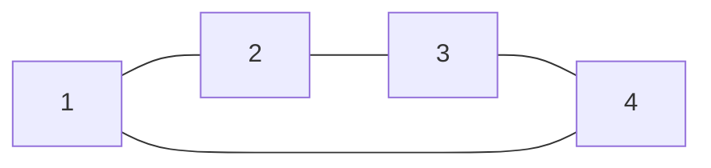

## Small Worlds
It is often the case than you can get from one node to another in a small number of steps.

We can use the **diameter** as an indicator of how many steps it will take to move information from one node to another.

### Average Distances
The **closeness centrality of a node $v$** is:

$$
\ell_v=\frac1n\sum_{u\in V}\text{dist}(v,u)
$$

where $\text{dist}(v,u)$ is the length of a shortest path from $v$ to $u$.

Then we can consider the average value of this measure to be:

$$
\ell=\frac1n\sum_{v\in V}\ell_v
$$

In real complex networks $\ell$ is typically small.
{:.info}

#### Average Distance Examples
Consider the following examples:

| Network | $n$ | $m$ | $\ell$ |
| :-- | --: | --: | --: |
| Film Actors | 449,913 | 25,516,482 | 3.48 |
| Company Directors | 7,673 | 55,392 | 4.6 |
| WWW | 269,504 | 1,497,135 | 11.27 |

Many of these networks are not connected. Distances between nodes in different components are set to zero. Averages are computed over existing links only.

{:.warning}

## Path Algorithms
### A-Star
I couldn't quite figure this out but I believe we only need the Floyd-Warshall algorithm for the exam.
{:.error}

### Floyd-Warshall Algorithm
To compute all values of $\ell_v$ (and hence $\ell$) we can use the following method:

```
let dist be a |V| x |V| array of minimum distances
for each vertex v
	dist[v][v] = 0
for each (u, v)
	if there is an edge (u, v)
		dist[u][v] = w(u, v) // the weight of the edge (u, v)
	else
		dist[u][v] = infty
for k from 1 to |V|
	for u from 1 to |V|
		for v from 1 to |V|
			if dist[u][v] > dist[u][k] + dist[k][v]
				dist[u][v] = dist[u][k] + dist[k][v]
			end if
```

#### Floyd-Warshall Algorithm Example
Consider that we have the following graph:



1. We create an initial table:

	| $v$ | 1 | 2 | 3 | 4 |
	| :-: | :-: | :-: | :-: | :-: |
	| 1 | 0 | 1 | $\infty$ | 1 |
	| 2 | 1 | 0 | 1 | $\infty$ |
	| 3 | $\infty$ | 1 | 0 | 1 |
	| 4 | 1 | $\infty$ | 1 | 0 |

1. Then complete the loop for $k=1$:

	| $v$ | 1 | 2 | 3 | 4 |
	| :-: | :-: | :-: | :-: | :-: |
	| 1 | 0 | 1 | $\infty$ | 1 |
	| 2 | 1 | 0 | 1 | 2 |
	| 3 | $\infty$ | 1 | 0 | 1 |
	| 4 | 1 | 2 | 1 | 0 |

1. And finally, in this case, for $k=2$:

	| $v$ | 1 | 2 | 3 | 4 |
	| :-: | :-: | :-: | :-: | :-: |
	| 1 | 0 | 1 | 2 | 1 |
	| 2 | 1 | 0 | 1 | 2 |
	| 3 | 2 | 1 | 0 | 1 |
	| 4 | 1 | 2 | 1 | 0 |
	
	The maximum value in this table is 2, this is the diameter.
	{:.info}

1. To calculate $\ell_v$ and $\ell$ we sum and average:

	| $v$ | 1 | 2 | 3 | 4 | $\ell_v$
	| :-: | :-: | :-: | :-: | :-: | :-: |
	| 1 | 0 | 1 | 2 | 1 | 1 |
	| 2 | 1 | 0 | 1 | 2 | 1 |
	| 3 | 2 | 1 | 0 | 1 | 1 |
	| 4 | 1 | 2 | 1 | 0 | 1 |
	
	$$
	\ell = 1
	$$
