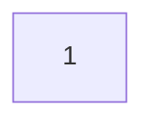
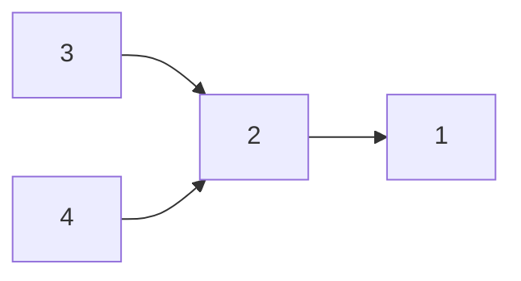

## Preferential Attachment

### Preferential Attachment Method

1. Start with any type of network.
1. Additinonal nodes get added one at a time.

   Each node in the network (except the existing nodes) have $c$ directed links out of them.

1. Each link is directed to a randomly chosen, previously generated, node.

   The chance that a node with in-degree $d$ is the end-point of a directed link is:

   $$
   \frac{d+a}{\sum(d+a)}
   $$

This produces the result that old nodes become more popular as they have a greater preferential attachment.

### Preferential Attachment Example

Consider we start with a network with a single node:

We can then continue the example by calculating the preferential attachment in a table, where $a=0.5$:

| Iteration |                 1 |                 2 |                3 |              4 |
| :-------- | ----------------: | ----------------: | ---------------: | -------------: |
| 1         |         $\frac11$ |
| 2         |         $\frac34$ |     $\frac{1}{4}$ |
| 3         | $\frac{1.5}{3.5}$ | $\frac{1.5}{3.5}$ | $\frac{.5}{3.5}$ |
| 4         |   $\frac{1.5}{5}$ |   $\frac{1.5}{5}$ |  $\frac{1.5}{5}$ | $\frac{.5}{5}$ |

Additional nodes are chosen by random number, weighted by the distribution of preferential attachment in the table.
