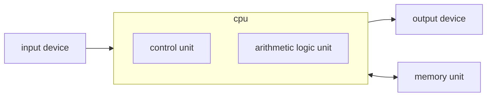
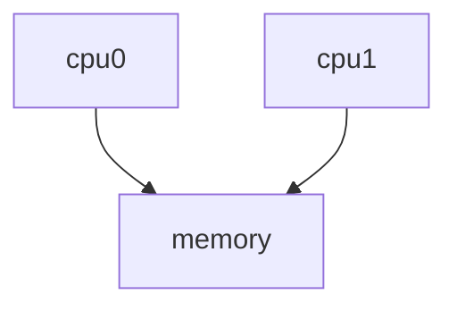

## Von Neumann Architecture
The Von Neumann architecture has the following block diagram:



Building on Alan Turing's work, Von Neumann invented the concept of the *stored program* where the programming is separate from the hardware of a general purpose computer.

Data and instructions share a common bus, hence the Von Neuman bottleneck.
{:.error}

### Von Neumann Cycle

1. IF - Fetch the instruction corresponding to the program counter from memory.
1. ID - Decode the instruction.
1. MEM - Fetch data from memory.
1. EX - Execute the instruction.
1. WB - Write back the results.

As each step is discrete, we can pipeline this process to process 5 instructions in 9 cycles instead of 1 in 5. 

This assumes each step takes one cycle to complete.
{:.info}

Once the pipeline is full then it effectively takes 1 cycle for each instruction.

We should be aware that running instructions that take many clock cycles create **pipeline bubbles**. This will block further instructions and empty the pipeline.
{:.warning}

### Advanced Pipe-lining

* Out of order execution completes execution when data is ready and presents the results in order when required.
* Speculative execution occurs on a branch. The CPU predicts which side is executed before the evaluation is complete. If it is incorrect then it will have to backtrack.
* Fused multiply-add implements

	$$
	a=a+(b\times c)
	$$
	
	as a single operation so speed up convolutions and matrix operations.
	
### Von Neumann Bottleneck Solutions
To move less data on the bus we can use:

* Cache on die:
	* The bigger the cache the slower it is due to searching for the data location.
		
		This can be solve by having a caching hierarchy: L1, L2, L3...
		{:.info}
* Temporal Locality:
	* If a memory location is accessed then is is very likely to be needed again soon.
* Spatial Locality:
	* Often with arrays, if a memory location is accessed, it is likely that it's neighbours will be accessed.
	
		When data is accessed, the whole **cache line** (64 bytes) is pulled.
		{:.info}

## Instruction Level Parallelism (ILP)
This is additional parallelism within a core.

### Vector Instructions (SIMD)
Consider we have the following code:

```c
for(int i = 0; i < 1000; i++) {
	c[i] = a[i] + b[i];
}
```

The compiler may optimise this to use vector instructions so that we can complete multiple additions in one clock cycle.

This requires that the serial instructions are not co-dependant.
{:.warning}

### Simultaneous Multi-threading (SMT)
If a processor has the hardware to support two threads natively:

* Two Program Counters
* Two Sets of Registers
* ...

Provided that we are using different pipelines within the processor (different instructions) we can get performance gains by making better use of the blocks in the processor.

### OS Thread Scheduling
We can use **thread pinning** to ensure that there are no **context-switches** while a program is running.

This removes the overhead involved in changing processor:

* Saving the program counter and registers, etc.

## Multi-Core Systems
With multi-core systems we run into the following issues:

* The memory bus is stretched further.
* Cache contention:
    * What if one core changes some data that another core needs soon after.
* Memory Contention:
    * Lock/semaphores.
* Interconnects need to be faster to support more cores.
* Programs need to be written differently to make best use of the cores.
* Load balancing.

We will use OpenMP as a solution for this.
{:.info}

## Multi-Socket Systems
So far we have seen systems like this:



This stretches the memory bandwidth even thinner between the two.

### NUMA

* Each CPU gets a dedicated bus to a section of **local** memory.
* Each CPU sees all the address space.
* If a processor needs data from non-local memory it must travel over the (slow) **interconnect**.
