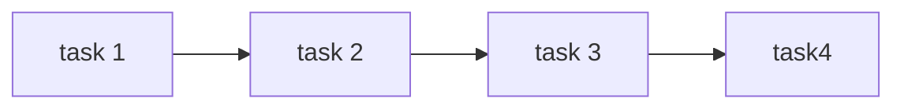

It is usually better to optimise single thread performance before going to parallelism:

* You often have to completely re-implement your algorithm when moving to multi-threaded operations.

You should consider your options in the following order:

1. Vectorisation
1. OpenMP
1. MPI
1. GPU
1. ASIC/FPGA

## Considerations
Generally there is load imbalance in parallel operations. The expected time is:

$$
\mathbb{E}[t]=\frac{\text{work}}{\text{#people}}
$$

This is a lower bound, which is generally not met due to imbalances and overheads.

## Performance By Design
Our implementation will often become tailored to the system it will run on. For any system we will:

* Meet the maximum performance of the system (roof-line model)
* Have below expected performance.

We can observe:

* There is no best solution for any system
* There is no universal solution for all systems.

This is a problem when trying to make portable code that will make best use of the hardware of all systems.
{:.warning}

To optimise for this problem we can use DSLs like:

* `pytorch`
* `tensorflow`

to make our programs **performance portable**. This means that we may get 80% of roof-line on all systems instead of variable performance based on the system.

## Data Parallelism
Given a dataset and an operation that can be applied to each element:

* Apply the operation concurrently to each element.

If you have more work than cores then equally divide between the cores.

## Task Parallelism
Several (different) independent tasks are to be applies to the same data:

* Ask each core to work on a different task on the same data.

This often results in load imbalance as the different operations often take different amounts of time.
{:.warning}

## Pipelines

* Many (potentially dependant) tasks are to be applied to a stream of data.
* Each data item is processed by stages that they pass through.
* Different items can be processed by different stages of the pipeline a the same time.

In general a job that takes:

$$
n_j\times n_d = \text{timesteps}
$$

by one core will take:

$$
n_d + (n_j - 1)= \text{timesteps} 
$$

where:

* $n_d$ is the amount of items
* $n_j$ are the number of jobs

There should be as many cores as jobs for this to be true. Additionally the pipeline should have enough items to fill up.
{:.warning}