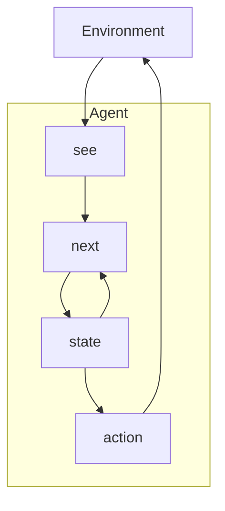
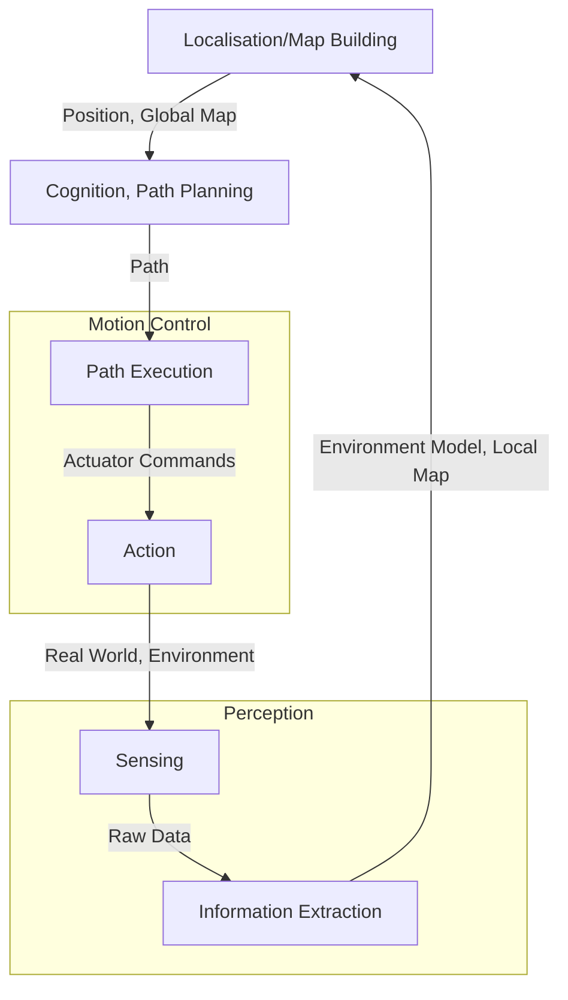
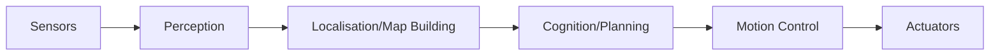
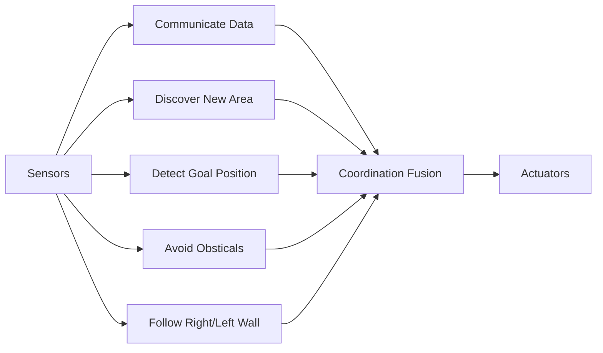

## Agents With State

## Tasks for Agents
We want to tell agents to complete a particular task without telling them how to do it. We can achieve this with the following tools.

### Utility Functions

* We associate **rewards** with states that we want agents to bring about.
* We associate **utilities** with individual states:
	* The task of the agent is to bring about states that maximise utility.
	
A **task specification** is a function which associates a real number with every environment sate:

$$
u:E\rightarrow\Bbb R
$$

#### Local Utility Functions
How to we apply a utility score to a state in a run?

It is difficult to specify a **long term** view when assigning utilities to individual states.
{:.warning}

One option would be to **discount** the cost for later states. This is what happens in **reinforcement learning**.

#### Local Utility Function Example

Consider we have a robot that wants to reach a reward:

* Each movement has a negative reward ($r=-0.04$)
	* This ensures that the agent will learn to get the reward in the shortest path.
* The target has a positive reward ($r=1$)

The **utility gained** is the sum of the rewards received.
{:.info}

## Mobile Robotics
To enable the robot to reach it's goal then we need to consider the following:

* Locomotion & Kinematics
* Perception
* Localisation & Mapping
* Planning & Navigation

### General Control Architecture

#### Perception & Localisation
This is how the robot senses the world:

* A **map** then says how these features sit relative to one another.
* A robot **localises** by identifying features and the position in the map from which it could see them.

#### Navigation
This is the process for finding a path through the map:

* It is important that we avoid obstacles.

### Architecture Approaches
#### Classical/Deliberative

Complete modelling:

* Function Based
* Horizontal Decomposition

#### Behaviour Based

* Sparse or no modelling.
* Behaviour Based
* Vertical Decomposition
* Bottom Up

#### Hybrid
This is a combination of the previous two approaches:

* Let lower level pieces be behaviour based:
	* Localisation
	* Obstacle avoidance
	* Data collection
* Let more cognitive pieces be deliberative:
	* Planning
	* Map building
	
## Reactive Architectures
Deliberative architectures aren't always ideal as planning may take too long and the environment may have changed.

### Brooks Behavioural Languages

1. Intelligent behaviour can be generated without explicit representations of the kind that symbolic AI proposes.
1. Intelligent behaviour can be generated without explicit abstract reasoning of the kind that symbolic AI proposes.
1. Intelligence is an emergent property of certain complex systems.

He identified two key ideas that have informed his research:

1. **Situatedness and embodiment**: ‘Real’ intelligence is situated in the world, not in disembodied systems such as theorem provers or expert systems.
1. **Intelligence and emergence**: ‘Intelligent’ behaviour arises as a result of an agent’s interaction with its environment. Also, intelligence is ‘in the eye of the beholder’; it is not an innate, isolated property.

### Emergent Behaviour
When observed behaviour exceeds the programmed behaviour, then we have emergence.

Flocking is an emergent behaviour. Each agent uses the following rules:

1. Don't run into any other agent.
1. Don't get too far from other agents.
1. Keep moving if you can.

#### Synergies
We can implement the following behaviours to follow a wall:

1. Move forwards with a slight bias towards the wall.
1. Avoid obsticles by turning in the opposite direction.
