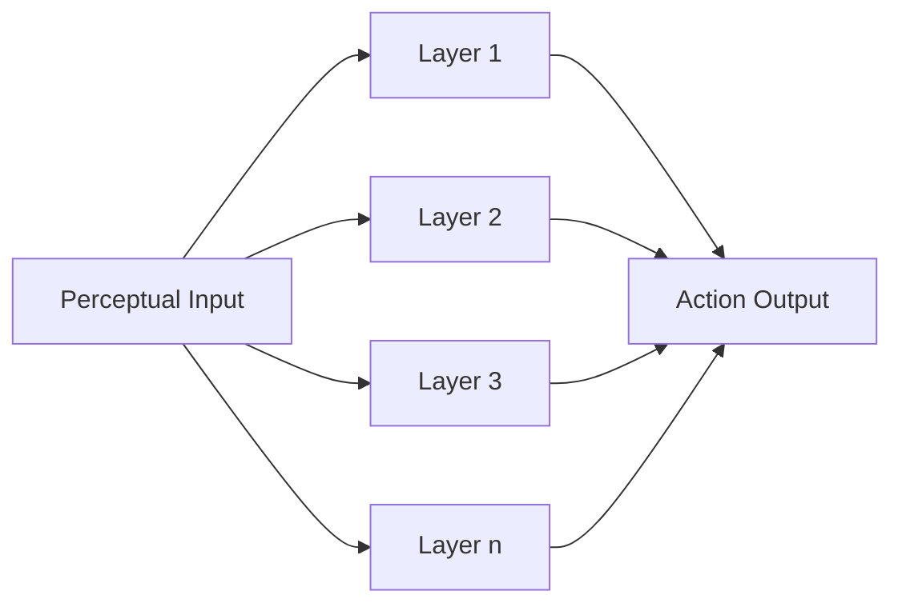
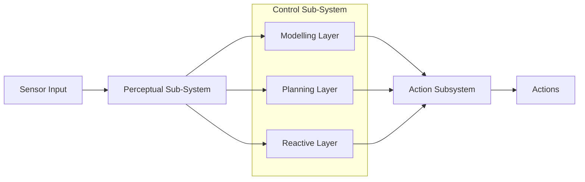

## Potential Fields
The robot is treated as a **point** under the influence of an **artificial potential field**. 

* The filed depends on the **targets** and goal as well as desired travel directions.
	* The goal attracts it, whilst obstacles repel it.
* The strength of the field may change with the distance to the obstacle or target.

The robot travels along the **derivative of the potential**. 

This is similar to a ball rolling down a smooth surface.
{:.info}

### Types of Fields

* **Uniform** - guides the robot in a straight line

	{:style="width:400px"}
* **Perpendicular** - pushes the robot away from linear obstacles

	{:style="width:400px"}
* **Tangential** - guides the robot around an obsticle

	{:style="width:400px"}

* **Attractive** - draws the robot to a point

	{:style="width:400px"}
	
	This can be useful for defining waypoints in a path.
	{:.info}
* **Repulsive** - pushes the robot away from a point

	{:style="width:400px"}

### Local Minima
One issue with potential fields is local minima. This is a **well in the field**.

There are various escape options:

* Backtracking
* Random Motioon
* Planner to search for a sub-optimal plan to escape.
* Increase potential of visited regions.

### Characteristics of Potential Fields

**Advantages**:

* Easy to visualise.
* Easy to combine different fields.

**Disadvantages**:

* High update rates necessary.
* Parameter tuning is important.

## Hybrid Architectures
Hybrid architectures combine both **deliberative** and **reactive** systems in order to control a robot.

In such an architectures, an agents control subsystems are arranged into a hierachy with higher layers dealing with information at **increasing levels of abstraction**.

### Horizontal Layers

* Layers are each directly connected to the sensory input and action output.
* Each layer acts like an agent, producing suggestions as to what action to perform.



### Vertical Layering

Sensory input and action output are each dealt with by at most one layer each.

* Vertical Layering (one pass control):
	
	```mermaid
	graph LR
	pi[Perceptual Input] --> l1[Layer 1]
	l1 --> l2[Layer 2]
	l2 --> l3[Layer 3]
	l3 --> ln[Layer n]
	ln --> ao[Action Output]#
	```
* Vertical Layering (two pass control):
	
	```mermaid
	graph LR
	pi[Perceptual Input] -->|1| l1[Layer 1]
	l1 -->|2| l2[Layer 2]
	l2 -->|3| l3[Layer 3]
	l3 -->|4| ln[Layer n]
	ln -->|5| l3
	l3 -->|6| l2
	l2 -->|7| l1
	l1 -->|8| ao[Action Output]
	```
	
### Ferguson - TouringMachines
The TouringMachine architecture consists of **perception** and **action** subsystems:

* These interface directly with the agent's environment, and three control layers, embedded in a control framework, which mediates between the layers.



The **control sub-system** mediates between the layers.
{:.info}

* The **reactive layer** is implemented as a set of situation-action rules (like a subsumption architecture).
* The **planning layer** constructs plans and selects actions to execute in order to achieve the agents goals
* The **modelling layer** contains symbolic representations of the *cognitive state* of other entities in the agent's environment.