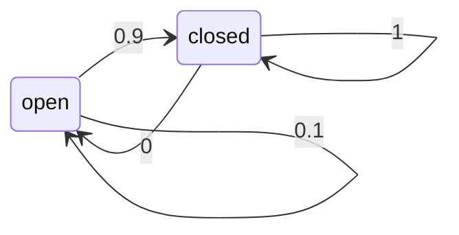

## Modelling Actions
Actions are never carried out with absolute certainty.

To incorporate the outcome of an action $u$ into the current **belief**, we use the conditional PDF $P(x\mid u,x')$:

* This term specified the PDF that executing action $u$ changes the state from $x'$ to $x$.

### Generating a PDF for Actions
The **probability distribution function** can be generated by:

1. Placing the robot in some state $x'$.
1. Executing the action $u$.
1. Measuring the state $x$.

These steps are then repeated a **large** number of times to build the PDF for the action $u$.

### Modelling Action Example
Assume we have the PDF $P(x\mid u,x')$ for the action $u=\text{close door}$. This can be represented as an FSM:

We can read: if the door is open, the action "close door" succeeds in 90% of all classes.
{:.info}

## Integrating the Outcome of Actions
To find $P(x\mid u)$ we sum (or integrate) over all the possible prior states (values of $x'$).

* Continuous case:

	$$
	P(x\mid u)=\int P(x\mid u,x')P(x'\mid u)dx'
	$$
* Discrete case:

	$$
	P(x\mid u)=\sum_{x'}P(x\mid u,x')P(x'\mid u)
	$$

We can assume that the action $u$ tells us nothing about the **prior** state of the door, and can be removed:

* Continuous case:

	$$
	P(x\mid u)=\int P(x\mid u,x')P(x')dx'
	$$
* Discrete case:

	$$
	P(x\mid u)=\sum_{x'}P(x\mid u,x')P(x')
	$$

### Calculating Belief Example

Given the following FSM and our sensor samples:

* $P(\text{open}) = \frac58$
* $P(\text{closed}) = \frac38$

We can calculate:

$$
\begin{align}
P(\text{closed}\mid u) &= \sum_{x'}P(\text{closed}\mid u,x')P(x')\\
&= P(\text{closed}\mid u,\text{open}) + P(\text{closed}\mid u,\text{closed})P(\text{closed})\\
&=\left(\frac9{10}\times\frac58\right)+\left(\frac11\times\frac38\right)\\
&=\frac{15}{16}
\end{align}
$$

$$
\begin{align}
P(\text{open}\mid u) &= \sum_{x'}P(\text{open}\mid u,x')P(x')\\
&=P(\text{open}\mid u,\text{open})P(\text{open})+P(\text{open}\mid u,\text{closed})P(\text{closed})\\
&=\left(\frac1{10}\times\frac58\right)+\left(\frac01\times\frac38\right)\\
&=\frac1{16}=1-P(\text{closed}\mid u)
\end{align}
$$

## Bayes Filters
Bayes filters allow us to:

* Calculate the posterior of the current state, **the belief**:
	* $\text{Bel}(x_t)=P(x_t\mid u_1, z_1,\ldots,u_t,z_t)$
	
$t$ is the current time.
{:.info}

To do this we need the following information:

* Stream of observations $z$ and action data $u$:
	* $d_t=\{u_1,z_1,\ldots,u_t,z_t\}$
* Sensor model:
	* $P(z\mid x)$
* Action model:
	* $P(x\mid u,x')$
* Prior probability of the system state:
	* $P(x)$
	
	This can be a normal distribution if we don't know.
	{:.info}

### Calculating Belief
Belief ca be derived as:

$$
\text{Bel}(x_t)=\eta P(z_t\mid x_t)\int P(x_t\mid u_t,x_{t-1})\text{Bel}(x_{t-1})dx_{t-1}
$$

this reduces to the following sum:

$$
\text{Bel}'(x)=\sum P(x\mid u,x')\text{Bel}(x')
$$