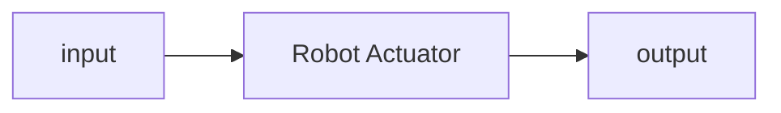
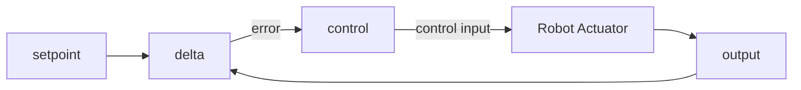
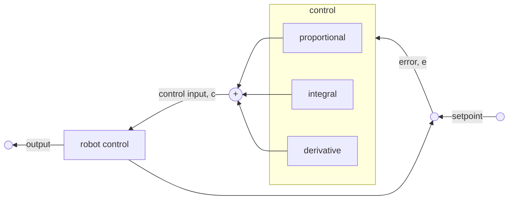

## Feedback Control
So far we have seen **open loop** control. This is where we make an observation, determine a plan to reach the goal and then execute that plan:

* This doesn't account for errors in the action of moving to the goal, or changes in the environment. 

### Closed Loop
This is where we sense the result of an action and feed back to adjust the action:

1. A reference signal (**set point**) is sent to the control. 
1. The input is observed, resulting in a **measured value**.
1. The difference between the set point and measure is the **error**.
1. Error can then be converted into a **control input**.

The aim is to reduce the error to zero.
{:.info}

As a robot is a dynamic system the control should be a function of:

* Present Behaviour
* Past Behaviour
* Future Behaviour

#### Present Behaviour
This part of the controller focusses on **current** behaviour:

* The output is proportional to the magnitude of the error:
	
	$$
	o_p\propto K_p
	$$
	
	where $K_p$ is the **proportional gain** for the proportional factor of the error.
	
	This gain determines how much the current error affects any changes to the input.
	{:.info}

Correcting an error may result in **over-correction**. This will produce an **oscillation** that should be **dampened**. This can be achieved by:

* Increasing the **sampling rate** to more rapidly respond to error.
* Reduce **gain** to avoid overshooting the zero error point.
	
	This also has the effect of slowing down convergence.
	{:.warning}

#### Future Behaviour
Momentum generated by a controllers response can cause oscillation:

* The control needs to be different when the system is close to the set point, compared to when it is far away.

This can be resolved by looking at future error:

* This is the gradient, or differential, of $o_p$:
	
	$$
	o_d=K_d\frac {de}{dt}
	$$
	
	where $K_d$ is the **derivative gain** for the derivative factor oif the error.
	
We can generate $K_d$ by comparing current and past error rates:

$$
o\approx K_d(e_t-e_{t-1})
$$

The derivative opposes the velocity of the proportionate control.
{:.info}

#### Past Behaviour
Past error is tracked by the integral term:

* It accumulates error over time relative to the set point:

	$$
	o_i=K_i\int e(t)dt
	$$
	
	where $K_i$ is the gain for the integral factor of the control signal
	
It should be generated over time such that:

$$
o_t=o_{t-1}+e_t
$$

## PID Controllers
A PID controller is the sum fo the proportional $p$, integral $i$ and derivative $d$ control terms:

$$
o=K_pe+K_i\int e(t)dt+K_d\frac{de}{dt}
$$

where the gains determine the significance of each of the terms.

If **state errors are negligent** then we can use a PD controller:

$$
o=K_pe+K_d\frac{de}{dt}
$$