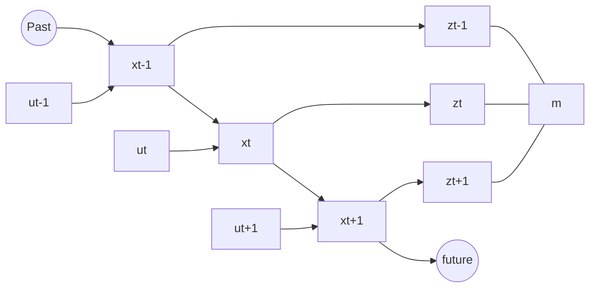

## Rejection Sampling
If we have a function $f$ we can sample random values from this function using the following method:

1. Sample $x$ from a uniform distribution $[-b,b]$.
1. Sample $y$ from $[0,\max f]$
	* If $f(x)>y$ then keep the sample.
	* Otherwise reject.
	
## Sampling vs Odometry

Sampling
: Determines a predicted new pose based on an initial pose $x_{t-1}$ and the motion $u_t$.

	When sampled multiple times, a point cloud is gained, representing the probability distribution for possible end locations.
	{:.info}

Odometry
: Provides a closed form expression for generating the probability of being in a location. This is computing the posterior: $p(x_t\mid u_t,x_{t-1})$.

## Map-Consistent Motion Model
We can rewrite the bayesian filter to include background knowledge of a map. The motion model becomes:

$$
p(x_t\mid x_{t-1}, u_t, m)
$$

Knowlege about features like walls, change the resulting probabilities.
{:.info}