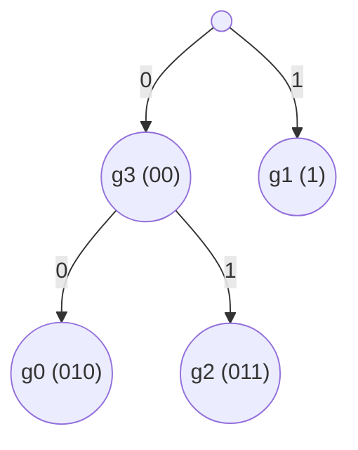

## Lossless Compression
Relies on probabilistic theory:

* Events that are less likely will contain more information.

A measure of average information is **entropy** also known as Shannon's Information Measure:

$$
H(x)=\sum_{i\in x}p(i)\log_2\left(\frac1{p(i)}\right)
$$

where:

* $x$ is a probabilistic experiment.
* $x_i$ are all the possible outcomes

The base of the logarithm is the unit of information (base 2 means that it is measured in bits).

### Entropy of an Image
The entropy $E$ of an $N\times N$ image is:

$$
E=-\sum^{L-1}_{i=0}p_i\log_2(p_i)
$$

where:

* $p_i$ is the probability of the $i^\text{th}$ greylevel.
* $L$ is the total number of greylevels.

additionally:

$$
0\leq E\leq \log_2L
$$

The average number of bits per pixel in a coder is:

$$
\hat L=\sum^{L-1}_{i=0}l_ip_i
$$

where:

* $p_i$ the probability of the $i^\text{th}$ greylevel.
* $l_i$ length in bits of the code for the $i^\text{th}$ greylevel.

### Image Entropy Example
Consider an image uses 3 bpp and the histogram is flat across the domain:

* As there are 3bbp there are 8 greylevels ($L=8$).
* Flat histogram means that the number of pixels at each greylevel are the same ($p_i\frac18$).

$$
\begin{aligned}
E&=-\sum^{L-1}_{i=0}p_i\log_2(p_i)\\
E&=-\sum^{7}_{i=0}\frac18\log_2(\frac18)\\
E&=3
\end{aligned}
$$

This means that there is no code that will provide better coding that what is used by default. An image with a flat histogram has the highest entropy.
{:.info}

## Huffman Coding
This is a type of coding that encodes frequent symbols as **short** strings of bits and infrequent symbols as longer bit strings.

* This is a minimum length code (it will generate close to the theoretical minimum).
* It generates variable length code.

Method:

1. **Sort** the symbols in decreasing order of probability.
1. **Combine** the smallest two by addition.
1. **Replace** the two elements with a single combined element.
1. Goto step 2 until only two probabilities are left.
1. **Work backwards** along the tree and generate the code by alternating 0 and 1.

### Huffman Coding Example
Consider a 10x10 image that uses 2bpp with the following histogram:

| Greylevel | Count |
| :-- | :-- |
| 0 | 20 |
| 1 | 30 |
| 2 | 10 | 
| 3 | 40 |

1. Find the probability of each level:

	| Greylevel | Probability |
	| :-- | :-- |
	| 0 | .2 |
	| 1 | .3 |
	| 2 | .1 | 
	| 3 | .4 |

1. Sort in descending order:

	| Greylevel | Probability |
	| :-- | :-- |
	| 3 | .4 |
	| 1 | .3 |
	| 0 | .2 |
	| 2 | .1 | 

1. Add the bottom two rows:

	| Original Greylevel | Probability | Reduction 1 | Reduction 2 | Sort 2 |
	| :-- | :-- | :-- | :-- | :-- |
	| 3 | .4 | .4 | .4 | .6 |
	| 1 | .3 | .3 | .6 | .4 |
	| 0 | .2 | .3 | |
	| 2 | .1 | | |
	
	Sort between each iteration.
	{:.info}
	
This gives the following Huffman tree:

## Coding Efficiency
Coding efficiency is defined as the ratio of entropy to the average number of bits per symbol.

For images we write this as:

$$
\eta =\frac E{\hat L}=\frac{-\sum p_i\log_2 pi}{\sum l_ip_i}
$$

## Bit Plane Decomposition
We can make use of bit plane decomposition to compress an image. We can then use compression techniques on each plane, to take advantage of contiguous blocks in the most significant bits.

### Constant Area Coding
Break the bit planes up into smaller sections of $n_1\times n_2$ pixels.

Each subsection can be encoded:

* 0 if it is white
* 10 if it is black
* 11 if it mixed black and white (followed by the bits used in the block).

### Run Length Encoding
In a binary image we can encode a line with runs of zeros first.

A line of:

$$
11111000011
$$

would be encoded as:

* 0, 5, 4, 2

There are zero 0s to start so we start with a zero.
{:.info}

## Lossy Compression
### JPEG
JPEG uses one of the following coding schemes:

* Lossy baseline coding:
	* Based on discrete coding transform (DCT).
* Extended coding for greater compression.
* Lossless independent coding.

#### Lossy Baseline Coding (DCT)

1. Pre-processing
	1. Convert the image to YCbCr.
	1. Partition the image into 8x8 tiles.
	1. Centre the intensity values about 0 (subtract 128 from each pixel).
1. Transformation
	1. Apply DCT to the image tile by tile.
	1. The pushes high-intensity values to the top left corner.
	1. The top-left is the DC component (average value of the pixels).
	1. The bottom-right corner is the AC component (has the highest frequency).
1. Quantisation
	1. Round elements towards zero (like floor).
		
		This removes high frequency components from the image and provides the lossy compression component.
		{:.info}
1. Encoding
	1. Reorganise the quantised DCT coefficients into a vector.
	1. Oder the coefficients in a zig-zag order.
	1. Apply Huffman coding.