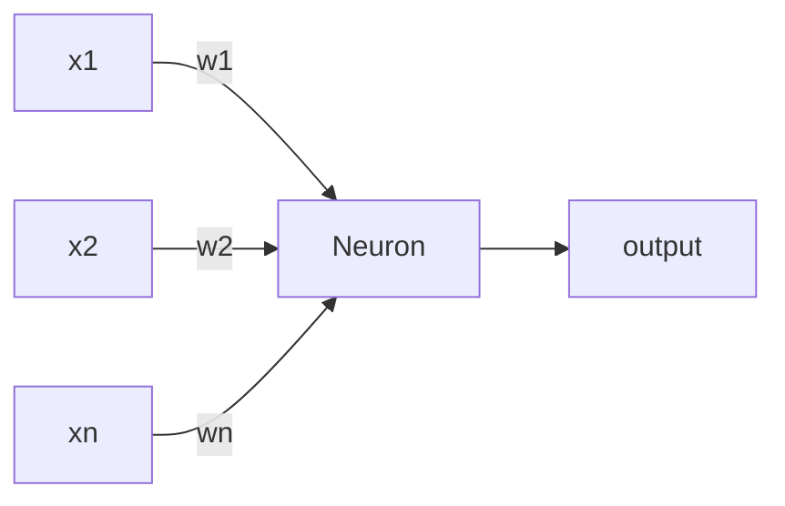

## Brains and (A)NNs
The brain is:

* Highly Complex
* Non-linear
* Massively parallel

ANNs (artificial neural networks) are biologically inspired analogues of the brain and are based on primitive neuron components. 

## Neuron Structure

Synapses
: Facilitate learning via creation of new, and modification of existing ones.

Axons
: Signal transmission structures

Dendrites
: Receptive structures

We can simulate a neuron with the following strucutre:

Each input has a weight and is summed as it enters the neuron to form the output:

$$
\sum^N_{i=1} x_i w_i
$$

We can then apply a threshold to the output if we want a **binary** output from the neuron.

## Advantages of ANNs

* Non-linearity
* Input-to-output Mapping
* Adaptivity
	* NN can be retrained to adapt to solve a changing task or be adapted to a similar one.
* Evidential Response
	* A confidence can be provided as to whether the output is correct.
* Contextual Information
	* Knowledge is integrated into the network. Each neuron is affected by all others; local processing and global awareness.
* Fault Tolerance
	* When small damage occurs, the network usually degrades gracefully.
* Uniformity of Analysis and Design
	* NNs are composed of similar components. This allows for modularity and use of mathematics for learning and network analysis.
* Neuro-biological Analogy
	* As the system is already implemented in nature. The system is proven.

## Using Machine Learning
Consider we want to use a NN to classify fish based on their lightness and width. We can use the following feature vector to represent each fish:

$$
x = [x_1,x_2]^\top
$$

Where:

* $x_1$ is lightness
* $x_2$ is width

Based on a set of training samples, the neural network could produce the following decision boundary by use of it's weights:

From this training we may observe the following phenomenon:

* Under-fitting
	* A machine learning model is not complex enough to accurately capture relationships between a dataset's features and the target variable.
* Over-fitting
	* The model is too closely fit to a limited set of data points and does not generalise well to unseen data points.