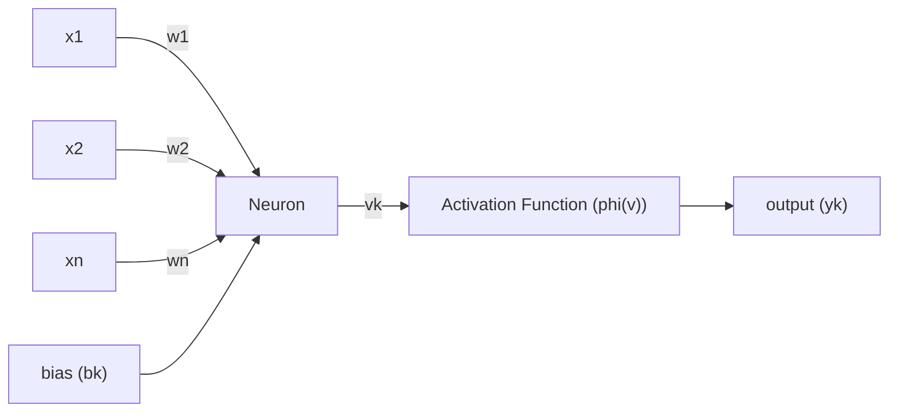

## Neuron Scheme
Each neuron is an information processing unit. Basic elements are:

* Synapses/Connections - Characterised by a weight $w_i$ and a signal $x_i$.
* Adder - Sums the input signals from the weighted synapses.
* Bias - $b_k$ is added to the sum.
* Activation function $\phi$ - Usually a non-linear function that produces the final output $y_k$.

$$
\begin{aligned}
v_k&=\sum^m_{j=0}w_{kj}x_j\\
&=\mathbf w^T_k\mathbf X\\
y_k&=\phi(v_k)
\end{aligned}
$$

Where:

* $\mathbf w^T_k=[x_{k0},\ldots,w_{km}]$
* $\mathbf X=[x_0, \ldots,x_m]$

## Types of Activation Functions
### Threshold/Heavyside Function
 [^ann]

[^ann]: [https://www.saedsayad.com/artificial_neural_network.htm](https://www.saedsayad.com/artificial_neural_network.htm)

This has a binary output:

$$
\phi(v)\begin{cases}1&\text{if}&v\geq0\\0&\text{if}&v<0\end{cases}
$$

* Limited to binary classification only.
* No gradient information.

### Piece-wise Linear Function
 [^ann]

$$
\phi(v)=\begin{cases}1 & \text{if} &v\geq\frac12\\v+\frac12&\text{if}&-\frac12<v<\frac12\\0&\text{if}&v\leq-\frac12\end{cases}
$$

* Narrow window of non-saturation.

### Sigmoid & Hyperbolic Tangent Functions
The following is a **sigmoid function**:

 [^ann]

there is also another s-shaped continuous function using $\tanh$.

Their ranges are:

* Sigmoid: 0 to 1
* $\tanh$: -1 to 1

$$
\phi(v)=\frac1{1+\exp(-\alpha\cdot v)}
$$

or

$$
\begin{aligned}
\phi(v)&=\tanh(v)\\
&=\frac{\exp(2v)-1}{\exp(2v)+1}\in(-1,1)
\end{aligned}
$$

### Rectified Linear Unit (ReLU)
 [^relu]

[^relu]: [https://learnopencv.com/understanding-activation-functions-in-deep-learning/](https://learnopencv.com/understanding-activation-functions-in-deep-learning/)

Most common choice in state-of-the-art neural networks (deep learning):

$$
\phi(v)=\max(v,0)=\begin{cases}v&v\geq0\\0&v<0\end{cases}
$$

* Non-linear
* Variants include leaky ReLU:
	* Has a shallow negative gradient when $v<0$.
	
## Network Architectures
### Single-layer Feed-forward Network

 [^sff]

[^sff]: [https://www.researchgate.net/figure/A-single-layer-feed-forward-neural-network_fig1_228394623](https://www.researchgate.net/figure/A-single-layer-feed-forward-neural-network_fig1_228394623)

One input layer of source nodes that project directly onto the output computation.

There are no cycles allowed.
{:.warning}

The output can be calculated using the following function:

$$
y_k(\mathbf X)=\phi\left(\sum^p_{j=0}W_{kj}X_j\right)
$$

### Multi-layer Feed-forward Network
 [^mff]

[^mff]: [https://www.researchgate.net/figure/Architecture-of-a-single-layer-feed-forward-neural-network_fig5_334439609](https://www.researchgate.net/figure/Architecture-of-a-single-layer-feed-forward-neural-network_fig5_334439609)

Has additional **hidden layers** in-between the input and output. These provide a more capable network:

* Typically the neurons of each layer take the previous layer as their input.
* Still no cycles.

The output can be calculated using the following function:

$$
y_k(\mathbf X)=\phi\left(\sum^{p_\text{hidden}}_{j=0}W_{kj}\underbrace{\phi\left(\sum^{p_\text{input}}_{i=0}W_{ji}\overbrace{X_i}^\text{input layer}\right)}_\text{hidden layer output}\right)
$$

### Convolutional Neural Networks (CNNs)
 [^conv]

[^conv]: [https://towardsdatascience.com/a-comprehensive-guide-to-convolutional-neural-networks-the-eli5-way-3bd2b1164a53](https://towardsdatascience.com/a-comprehensive-guide-to-convolutional-neural-networks-the-eli5-way-3bd2b1164a53)

A class of multi-layer feed-forward network with a special type of local connections:

* Widely used for image classification.
* A convolution is used to gain deeper understanding of the image.

### Recurrent Networks
These have **feedback loops** which form cycles in the graph:

* Feedback loops involve connections with unit-delay elements $z^{-1}$, which together with nonlinear activations enable the nonlinear dynamic behaviour of the network.

We can calculate the output of a recurrent, no hidden, delay one, self feedback network with the following:

$$
y_k(n)\equiv y_k(\mathbf X(n),n)=\phi\left(\underbrace{\sum^{p_\text{input}}_{i=0}W_{ki}X_i(n)}_\text{current input}+\underbrace{\sum^{p_\text{output}}_{j=0}W_{kj}y_j(n-1)}_\text{past output}\right)
$$

## Knowledge Representation
The primary task of a NN is to learn it's environment. To accomplish this, we need to feed it with environment knowledge, which is based on:

* Observations - These are often noisy, contain errors and have redundant/missing information.
	* These can be **labelled** or **unlabelled** with the ground truth for that sample.
	
### Training Dataset Example
A set $\{\{x_i, y_i\}\}, i=1,2,\ldots$ of experimentally acquired data is referred as a training dataset:

* OCR:
	* $x$ = Pixel values or curves.
	* $y$ = A, B, C, ...
	
### Training Process
1. Choose a subset of the available observations as a training dataset to teach the NN. 
	
	This set should be diverse and representative of data used in production.
	{:.info}
1. Choose an appropriate architecture, with as many input nodes as the length of the input feature vector $x$ and output nodes needed for the output $y$.
1. Train the network on the training dataset.
1. Test the network with the remaining data.
