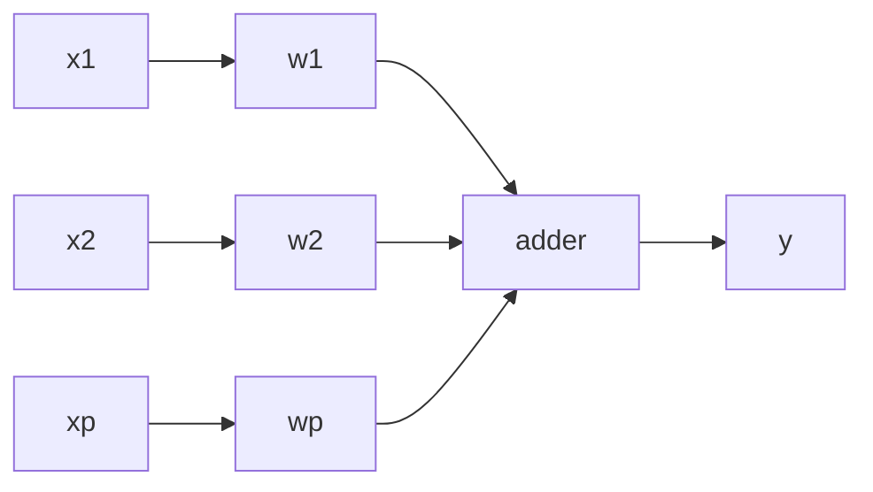
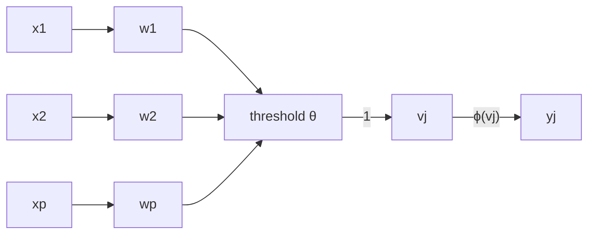

## Least Mean Square (LMS)
This is a **sample by sample** approach. The linear least square method would be a batch approach.

$$
\mathbf w(n+1)=\mathbf w(n)+\eta e(n)\mathbf x(n)
$$

where:

* $\mathbf w$ - weight vector
* $\eta$ - learning rate
* $e$ - the error $(d-y)$
* $d$ - expected result
* $y$ - neron output
* $\mathbf x$ - input vector

This uses value from a simple single layer network:

## Perceptron
Rosenblatt's Perceptrons are based on the McCulloch-Pitts neuronal modal. They are similar to linear neurons, but they have **non-linear activations** based on thresholding activations:

$$
v_j=\sum^p_{i=1}w_ix_i+\theta=\mathbf w^T\mathbf x
$$

with:

$$
y_j=\phi(v_j)
$$

This uses the following network:

