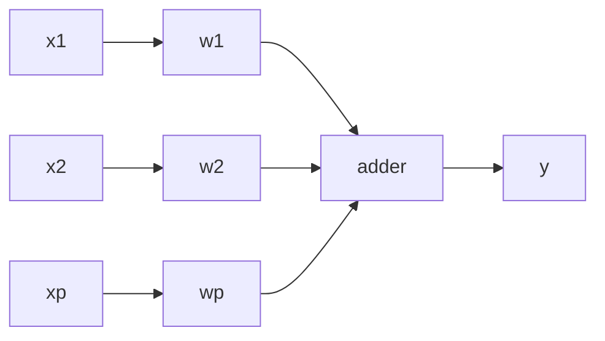
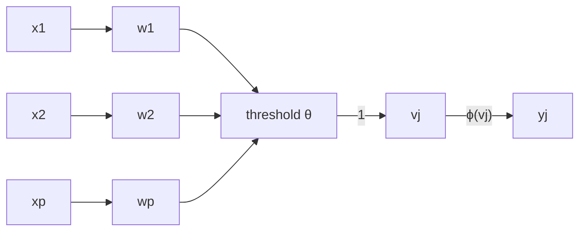

## Least Mean Square (LMS)
This is a **sample by sample** approach. The linear least square method would be a batch approach.

$$
\mathbf w(n+1)=\mathbf w(n)+\eta e(n)\mathbf x(n)
$$

where:

* $\mathbf w$ - weight vector
* $\eta$ - learning rate
* $e$ - the error $(d-y)$
* $d$ - expected result
* $y$ - neron output
* $\mathbf x$ - input vector

This uses value from a simple single layer network:



## Perceptron
Rosenblatt's Perceptrons are based on the McCulloch-Pitts neuronal modal. They are similar to linear neurons, but they have **non-linear activations** based on thresholding activations:

$$
v_j=\sum^p_{i=1}w_ix_i+\theta=\mathbf w^T\mathbf x
$$

with:

$$
y_j=\phi(v_j)
$$

This uses the following network:



## Example Questions

1. Derive the weight update for a linear neuron using least mean square (LMS).
	
	$$
	e=d-y
	$$
	
	where:
	
	* $d$ - expected output
	* $y$ - output neuron
	
	$$
	E=\frac12e^2
	$$
	
	Assume we are somewhere on the following curve:
	
	 [^desc]
	
	We can then use the gradient of a line to approximate our descent:
	
	$$
	y=mx+c
	$$
	
	where in this case:
	
	* $y$ = $\mathbf w(n+1)$
	* $m$ = gradient of $E$ (vertical axis)
	* $c$ = $\mathbf w(n)$
	* $x$ = $w$ the weight
	
	We can then differentiate to calculate the output:
	
	$$
	\begin{aligned}
	\frac{\partial E}{\partial w}&=\frac{\partial E}{\partial e}\cdot\frac{\partial e}{\partial w}\\
	&=e\cdot\frac{\partial e}{\partial w}
	\end{aligned}
	$$
	
	then from the gradient:
	
	$$
	y=mx
	$$
	
	implies
[^desc]: [https://editor.analyticsvidhya.com/uploads/97106gd4.jpeg](https://editor.analyticsvidhya.com/uploads/97106gd4.jpeg)

1. Learn an `OR` function using the following perceptron:
	
	```mermaid
	graph LR
	x1 --> w1
	x2 --> w2
	x0 --> w0
	w0 --> n[neuron]
	w1 --> n
	w2 --> n
	```
	
	where:
	
	* $W = [w_0, w_1, w_2] = [-1, 1, -2]$
	* $\eta = \frac12$
	
	We want to adjust the weights until all the input patterns on $x_1$ and $x_2$ produce the correct outputs.
	
	| Epoch | Input | Weights | Output | Expected Out | Error |
	| :-- | :-- | :-- | :-- | :-- | :-- |
	| 1 | -1, 0, 0, | -1, 1, -2 | 